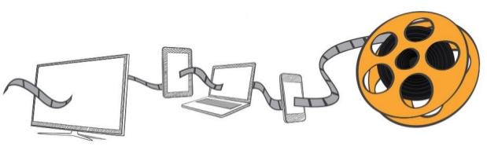

---

title: FFmpeg 常用選項
categories: 
  - tech
series:
  - media
tags:
  - FFmpeg
date: 2017-12-22 17:04:38

---



接續著上次的簡介及流程介紹，這次就來聊聊常用到的選項（還偷渡了一點我會用到的 XDD）

一開始我們先來確認 FFmpeg 的版本 ＆ 內含 Library，這關係到我們能用的功能，好比說我想轉 H.264 的 Codec，那麼我就要先確認我有沒有 `libx264` 這個函式庫

```zsh
$ ffmpeg -version
```

<!-- more -->

再來我們來複習一下上次說到的指令語法結構：

```zsh
$ ffmpeg [全域選項] \
  {[輸入選項] -i 輸入檔案路徑} \
  [...] \
  {[輸出選項] 輸出檔案路徑} \
  [...]
```

> 依照 FFmpeg 的元件來拆解會是下面的樣子：
>
> ```zsh
> $ ffmpeg -c:v {視訊解碼器} \
>   -c:a {音訊解碼器} \
>   -f {多工解訊器} \
>   -i {輸入檔} \
>   -c:v {視訊編碼器} \
>   -c:a {音訊編碼器} \
>   -f {多工器} \
>   {輸出檔}
> ```

## 選擇串流 ##

在上次提到在一檔案進到 FFmpeg 後會先透過 demuxer 讀出各個串流，有可能是 Video 或 Audio，更甚至於是字幕，所以在設定輸入及輸出的時候也要給予相對應的設定；可以透過 `-map` 來指定串流，又或者是利用 `-vn` / `-an` / `-sn` 來做選擇。

* -map [輸入檔案索引][:串流識別符]   
挑選輸入串流

* -vn   
禁用影像輸出

* -an   
禁用音訊輸出

* -sn   
禁用字幕輸出

另外在某些選項上也可以針對串流去做設定，語法結構為：

```text
-選項[:串流類別][:串流索引] [設定值]
     ------------------
             /|\
              |
           串流識別符

# 串流類別有 v, a, s, d, t，分別代表了：視訊（Video）、音訊（Audio）、字幕（Subtitle）、資料（Data）、附件（Attachment）
# 串流索引是從 0 起算
```

例如：
`-codec:a libfdk_aac`，表示所有音訊用 libfdk_aac 編碼

## 主要選項 ##

* -y（全域）  
若存在則覆蓋檔案

* -n（全域）  
若存在則退出

* -i 檔案路徑（輸入）
設定輸入的檔案

* -codec[串流識別符] 編解碼器（輸入/輸出，每一個串流）
與 `-c` 同義，設定編解碼器，copy 表示不進行編碼（只用於輸出）

* -ss 時間戳記（輸入/輸出）  
指定開始時間，格式為：`hh:mm:ss[.xxx]` 或秒數。  
在輸入時會跳轉到指定時間點並歸零的當前時間戳記。  

> 在大多數的格式中並無法精確定位到指定時間，所以 FFmpeg 會跳轉到最接近指定時間 “前” 的可定位點。另外若有轉碼且設置了 `-accurate_seek`（默認），則定位點到指定時間中間的數據會被轉碼但丟棄掉；如果是複製（copy）模式或設置了 `-noaccurate_seek`，則數據會被保留

在輸出時則會從頭開始解碼，但丟棄指定時間點前的數據。

* -t 時間戳記（輸入/輸出）  
設定總長，格式為：`hh:mm:ss[.xxx]` 或秒數

* -to 時間戳記（輸出）  
寫入到指定時間後就停止，格式為：hh:mm:ss[.xxx] 或秒數
> `-to` 和 `-t` 互斥，`-t` 的優先權較高

* -filter[串流識別符] filtergraph（輸出，每一個串流）  
設定使用的 filtergraph 濾鏡

* -filter_complex filtergraph（輸出，每一個串流）  
設定一個複雜的 filtergraph 濾鏡（多個輸入/輸出）

* -target 類型（輸出）  
指定輸出類型（`vcd`、`svcd`、`dvd`、`dv`、`dv50`），另外類型還可以前綴標記（`pal-`、`ntsc-`、`film-`）來設置更明確的格式。設定格式後會幫你帶入其他的設定（解析度、畫格速率、編碼參數、位元率、緩衝）。

* -f 檔案格式  
一般來說是不用設置這個選項，因為 FFmpeg 會依照輸入或輸出來做判斷 


## Video 選項 ##

* -r[:串流識別符] fps（輸入/輸出，每一個串流）  
設定 framerate  
作為輸入選項時會忽略來源的 fps，強制給予給定的 framerate。
作為輸出選項時會複製或丟棄 frame 來滿足要求。

* -s[:串流識別符] WxH（輸入/輸出，每一個串流）  
設定畫布大小，如：320x240
作為輸入選項時，等同於部分選項的私有設定 `-video_size`
作為輸出選項時，等同於 scale 濾鏡

* -vcodec 編碼器（輸出）  
設定視訊的編碼器，等同 `-codec:v`

* -pass[:串流識別符] n（輸出，每一個串流）  
設定 two-pass 的階段。用 two-pass 編碼時，第一次通常會把統計的結果存到一份 log 中，供第二次分析用。

* -passlogfile[:串流識別符] 前綴（輸出，每一個串流）  
設定 two-pass 的 log 存放位置

* -vf filtergraph（輸出）  
等同 `-filter:v`


## Video 進階選項 ##

* -pix_fmt[:串流識別符] 格式（輸入/輸出，每一個串流）  
轉換像素格式，可用 `-pix_fmts` 指令查看是否支援


## Audio 選項 ##

* -acodec 編碼器（輸出）  
設定音訊的編碼器，等同 `-codec:a`

* -ac[:串流識別符] 聲道數（輸入/輸出，每一個串流）  
設定聲道的數量，預設是輸出與輸入相同


## 編解碼選項（Codec） ##

從上述的介紹中得知，我們可藉由 -codec 來設定編解碼器，每個編解碼器也會有私有的設定選項，這裡就先列出通用的

> 這裡選項後的括弧表示它可運作的範圍

* -b 位元率（編碼/視訊/音訊）  
設定串流的 bitrate

* -bf 整數（編碼/視訊）  
設定 B-Frame 的間隔數，範圍 -1 ～ 16，0 表示禁止，-1 表示交由編碼器決定，預設為 0 

* -bufsize 大小（編碼/視訊/音訊）  
設定緩衝區大小（bit）

* -maxrate 位元率（編碼/視訊/音訊）  
設定最大流量容許值

* -minrate 位元率（編碼/視訊/音訊）  
設定最小流量容許值，通常用於 CBR，否則無意義

* -g 整數（編碼,視訊）  
設定 GOP 的大小，即 IDR-frames（keyframes）最長間格
