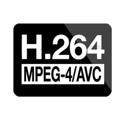

---

title: FFmpeg H.264 編碼器
categories: 
  - tech
series:
  - media
tags:
  - FFmpeg
  - H264
date: 2017-12-23 23:44:58

---



H.264 / MPEG-4 AVC 是目前最被廣泛被應用的視訊編碼格式，它的壓縮效率比 MPEG-2、MPEG-4、RV40 ...等舊視訊編碼格式還要高許多。

如果要輸出 H.264 / AVC 視訊編碼，則需要 `libx264` 編碼器，FFmpeg 的組態設定之中必須有 `--enable-libx264` 則才可以使用。

H.264 有多個版本，版本越高壓縮比就越高（對應到 profile）

<!-- more -->


## 碼率控制（Rate control） ##

Rate control 是指控制 `每個畫格用了多少個位元` 的方法，這將影響檔案大小和品質分布。這裡就先不探討 Rate control 的種類有哪些。
通常會用下列兩種模式： Constant Rate Factor (CRF)、Two-Pass ABR，若沒有控制輸出大小的需求則使用 CRF 即可

### Constant Rate Factor（CRF） ###
固定品質指標，而不在意大小；CRF 會得到最佳的 bitrate 分配結果，缺點是你不能直接指定一個目標 bitrate 或是檔案大小。  
設定值範圍為 0 – 51（可能會依照編譯版本而不同），0 為最高品質，預設值為 23，建議的範圍在 18 - 28，17 或 18 接近視覺無損，但在技術上來說並不是無損。

### Two-Pass ABR（Average Bitrate） ###
以平均值來說 ABR 與 CBR 相同，但 ABR 允許在 “適當” 的時候使用更好的 bitrate 以取得更好的畫質，但 ABR 是用動態補償的方式來計算畫面的複雜度，也就是說在影片的起始及開頭，或是當畫面不如預期變化的時候則可能會影響到產出。  
所以在 two-pass 的時候，第一次轉檔時會先分析紀錄影片的內容，第二次再依照分析的結果加以轉碼，但相對的就是非常耗時，要是沒有輸出大小的需求，則用 CRF 即可。


## Preset ##
為選項集合，用來設定編碼速度，相對的也會影響到壓縮比；編碼越快則壓縮比越低。
一速度遞減排序為：`ultrafast`、`superfast`、`veryfast`、`faster`、`fast`、`medium`（預設）、`slow`、`slower`、`veryslow`、 ~~placebo~~

## Tune 選項 ##
也是為一個集合選項，可針對特定的影片類型微調參數設定值，以獲得更好的品質或壓縮率

* Film：`film`，用於高解析度電影，降低 deblocking
* Animation：`animation`，動畫＆卡通，使用 deblocking 和較多的 reference frames
* Grain：`grain`，保留舊影片的顆粒感
* Still Image：`stillimage`，幻燈片效果的影片
* Fast Decode：`fastdecode`，啟用部分禁用的 filter 來加速編碼
* Zero Latency：`zerolatency`，快速編碼＆低延遲
* PSNR：`psnr`，優化 PSNR 
* SSIM：`ssim`，優化 SSIM 

## Profile ##

複合選項，Profile 越好壓縮比也越高，但編碼複雜度相對提升；越好的 Profile 相對啟用的功能也越多，所以對播放硬體的需求也較高

<table>
    <tr>
        <th colspan="4"> Profiles </th>
    </tr>
    <tr>
        <td></td>
        <td> baseline </td>
        <td> main </td>
        <td> high </td>
    </tr>
    <tr>
        <td>no-8x8dct</td>
        <td>1</td>
        <td>1</td>
        <td></td>
    </tr>
    <tr>
        <td> bframes </td>
        <td>0</td>
        <td></td>
        <td></td>
    </tr>
    <tr>
        <td>no-cabac</td>
        <td>1</td>
        <td></td>
        <td></td>
    </tr>
    <tr>
        <td> cqm </td>
        <td>flat</td>
        <td>flat</td>
        <td></td>
    </tr>
    <tr>
        <td> weightp </td>
        <td>0</td>
        <td></td>
        <td></td>
    </tr>
</table>

## Level ##

複合選項，與解碼器的效能及容量對應，Level 越高需求越高

<table>
    <tr>
        <th colspan="6"> Level </th>
    </tr>
    <tr>
        <td></td>
        <td>MaxMBPS(MB/s)</td>
        <td>MaxFS(MBs)</td>
        <td>MaxDpbMbs(MBs)</td>
        <td>MaxBR(kbit/s)(Baseline,Main Profiles)</td>
        <td>Examples for high resolution@ highest frame rate</td>
    </tr>
    <tr>
        <td>3.0</td>
        <td>40,500</td>
        <td>1,620</td>
        <td>8,1000</td>
        <td>10,000</td>
        <td>
            176×144@172
            352×240@120
            352×480@60
            720×480@30
            720×576@25
        </td>
    </tr>
    <tr>
        <td>3.1</td>
        <td>108,000</td>
        <td>2,600</td>
        <td>18,000</td>
        <td>14,000</td>
        <td>
            352x288@172
            352x576@130
            640x480@90
            720×576@60
            1,280×720@30
        </td>
    </tr>
    <tr>
        <td>4.0</td>
        <td>245,760</td>
        <td>8,192</td>
        <td>32.768</td>
        <td>20,000</td>
        <td>
            720x480@172
            720x576@150
            1,280×720@60
            2,048×1,024@30
        </td>
    </tr>
    <tr>
        <td>4.1</td>
        <td>245,760</td>
        <td>8,192</td>
        <td>32,768</td>
        <td>50,000</td>
        <td>
            720x480@172
            720x576@150
            1,280×720@60
            2,048×1,024@30
        </td>
    </tr>
    <tr>
        <td>4.2</td>
        <td>522,240</td>
        <td>8,704</td>
        <td>34,816</td>
        <td>50,000</td>
        <td>
            720x576@172
            1,280×720@140
            2,048×1,080@60
        </td>
    </tr>
</table>

### Decoded picture buffering ###

```text
capacity = min(floor(MaxDpbMbs / (PicWidthInMbs * FrameHeightInMbs)), 16)
```

<table>
    <tr>
        <td>Level</td>
        <td>3.0</td>
        <td>3.1</td>
        <td>4.0</td>
        <td>4.1</td>
        <td>4.2</td>
    </tr>
    <tr>
        <td>MaxDpbMbs</td>
        <td>8,100</td>
        <td>18,000</td>
        <td>32,768</td>
        <td>32,768</td>
        <td>34,816</td>
    </tr>
</table>


## 自定義 ##

以上說的都是複合指令，若是有需求也可利用 -x264-params 做個別設定

可參考：
[https://ffmpeg.org/ffmpeg-codecs.html#libx264_002c-libx264rgb](https://ffmpeg.org/ffmpeg-codecs.html#libx264_002c-libx264rgb)

* `-I`, `keyint`  
設定 i-frame 間隔，也就是 GOP size

* `-i`, `--min-keyint`  
最小 GOP size

* `-r`, `--ref`  
控制 DPB（Decoded Picture Buffer） 大小，表示 P-frame 參照多少個 frame。預設值為 3，範圍：0 - 16。

* `--scenecut`  
配置動態 i-frame 的參考值；x264 的 frame 中會紀錄與參考 frame 的差異，當判斷差異過大時就是場景變更，此時就會插入一個 i-frame 來做紀錄，差異的依據可由設定 scenecut 來做判別，當設為 0 時等同 no-scenecut。

* `--no-scenecut`  
停用 adaptive I-frame decision

## 參數優先順序 ##
```text
preset -> tune -> "custom" -> profile -> level
```
