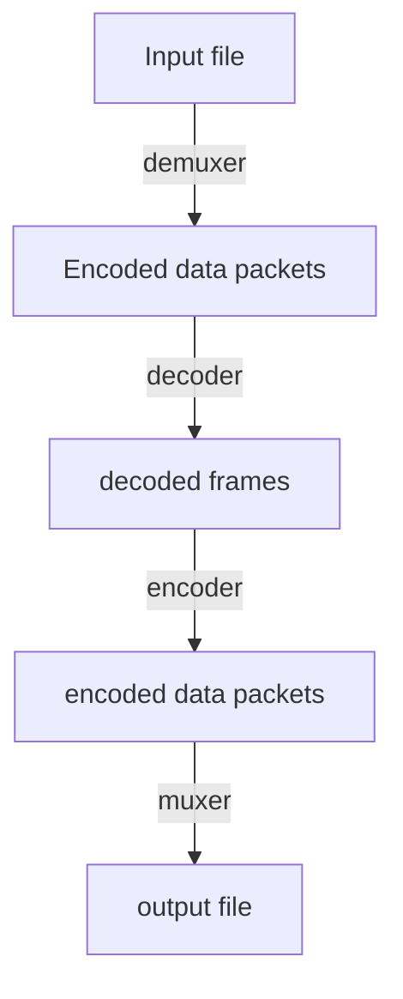
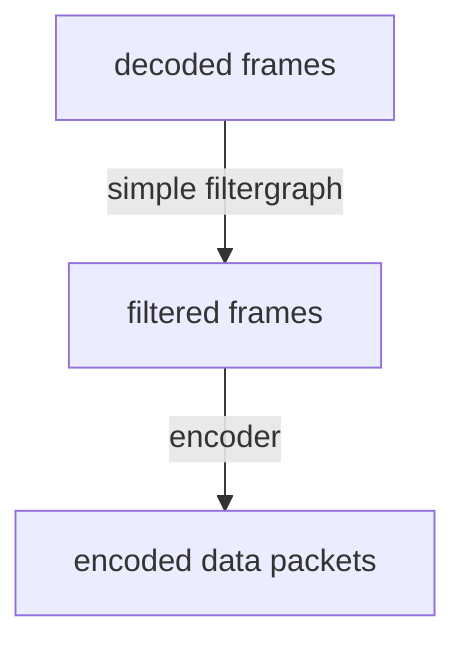
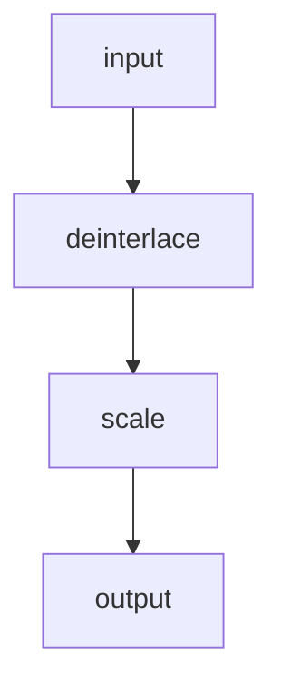
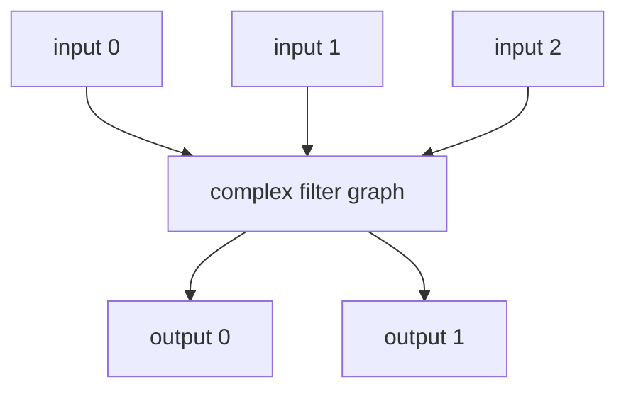
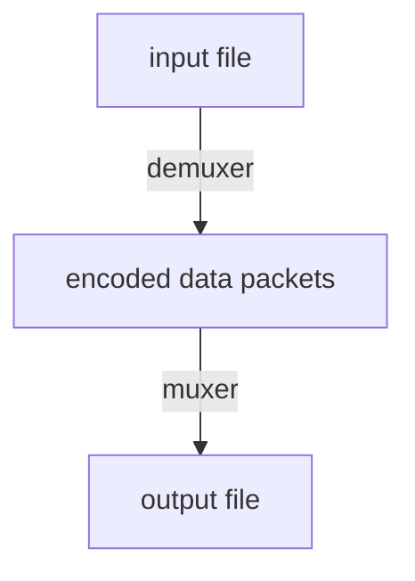

---

title: FFmpeg 多媒體框架
categories: 
  - tech
series:
  - media
tags:
  - FFmpeg
date: 2017-12-20 17:04:38
libraries:
  - mermaid

---


FFmpeg 為開源的影音處理框架，可幫助我們進行影音的格式轉換、分離、混合、過濾等等，[支援格式](http://ffmpeg.org/general.html#Supported-File-Formats_002c-Codecs-or-Features) 也非常的廣泛，也可以在多個作業系統及硬體架構上運作。同時也支援多種函式庫，更增加使用上的彈性，依照需求建立出最適合的工具。

<!-- more -->

FFmpeg 包含許多的函式庫

* libavcodec：用來編碼與解碼不同的影音格式
* libavutil：一些程式上會用到的函式與資料結構
* libavformat：用來處理承載影音串流的多媒體容器
* libavfilter：用來進行視訊和音訊的濾鏡處理
* libavdevice：用來從不同的裝置輸入多媒體，或是將多媒體輸出至不同裝置
* libswscale：用極佳的方式縮放影像，也可以用來轉換色彩空間
* libswresample：用極佳的方式處理音訊取樣

還可以支援其他的第三方函式庫，如：`libx264`、`libvpx`、`libfdk_aac`；依照這些函式庫 FFmpeg 提供了許多的工具：

* ffmpeg：Command line tool，用來轉換不同格式的多媒體檔案
* ffserver：用於線上廣播的多媒體串流伺服器
* ffplay：基於 SDL 和 FFmpeg 函式庫的簡易播放器
* ffprobe：簡易的多媒體串流分析工具


## 安裝 ##

安裝的部分就略過了，官方提供的方式非常多元，可參照官網上的敘述：[https://www.ffmpeg.org/](https://www.ffmpeg.org/)，我個人因為用的是 Mac，採用的是 Homebrew 安裝管理

再來就是重頭戲了～～～  
因為 FFmpeg 的功能非常強大，也涉及一些影音的知識，我這裡就先就操作和流程去說，其他的再慢慢補完：

## 語法結構 ##

```zsh
# 支持多個輸入和輸出，所以 `...` 代表可傳入多個的意思
$ ffmpeg [全域選項] \
  {[輸入選項] -i 輸入檔案路徑} \
  [...] \
  {[輸出選項] 輸出檔案路徑} \
  [...]
```

## 運作流程 ##



用 `libavformat` 來分離輸入的檔案，再利用 decoder 去解出非壓縮的內容，再透過 filter 過濾，經過壓縮後再混合成新的檔案。

上述的圖再編碼之前還可以進一步被 filter 處理（使用 `libavfilter` 函式庫），而 filter 可組成 filtergraphs，filtergraphs 在依照輸入及輸出可分成 Simple filtergraphs & Complex filtergraphs。

### Simple filtergraphs ###



Simple filtergraphs 透過 `-filter` 來做設定，以下是一個 Simple filtergraphs 的範例：



### Complex filtergraphs ###



Complex filtergraphs 透過 `-filter_complex` 這個全域選項來做設定

### Stream Copy ###

再來我們聊聊 Stream copy，有時候我們並無意改變 Codec，只想改變 video 的 container，那麼我們可以用 `-code copy` 來做設定，但同時也意味著沒有經過解碼及編碼階段，也不會有 filter 的處理。




## 參考資料 ##

[ffmpeg Documentation](https://www.ffmpeg.org/ffmpeg.html)

[FFmpeg - 泛用影音轉換工具 - Mobile01](https://www.mobile01.com/topicdetail.php?f=510&t=3734550)

