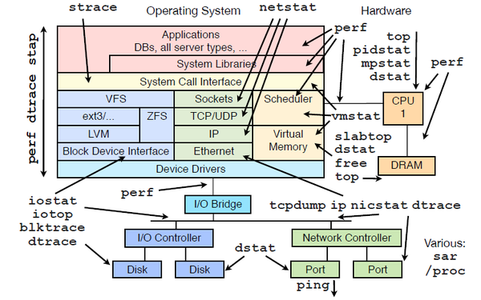

---

title: File Locking
categories: 
  - tech
tags:
  - Linux
  - Golang
  - PHP
  - lock
  - flock
  - fcntl
  - EFS
date: 2018-02-09 20:20:39

---


> 再動手寫這篇之前，我踩到了一個雷，這篇描述了一下我遇到的問題跟解法，若是有人有更好的想法，或是我哪裡有搞錯了，請告訴我，我會非常感謝的！！！

## 遇到問題 ##

用 Golang 寫了一隻利用 goroutine 去做事的程式，並放在 AWS EC2 spot fleet 去做 auto scale，其中每台 EC2 instances 上掛載了 EFS 把 Log 寫在內，運行了以後發現 Log 不完整，會有字串被截斷或消失的狀況。

<!-- more -->

## Linux File Locking ##

Linux 是多人多工的系統，在使用上常會遇到同時編輯的狀況，若是一個 porcess 在讀取別的 process 正在讀寫的檔案，可能會讀到不完整的內容。再來我們來看一下在 Linux 中怎麼解決這個問題。

在 Linux 中可依照鎖定的類型分為兩類：`Advisory Lock`（建議鎖） & `Mandatory Lock`（強制鎖），依照鎖定的動作也可以分為兩種：讀 & 寫，而鎖定後其他的 process 是否等待鎖定解除也可以再給予設定。

Advisory Lock 和 Mandatory Lock 的差別在於內核是否介入，在 advisory lock 中系統內核提供了加鎖及查詢是否鎖定的方法，但是不參與鎖的控制及協調，也就是說要是有 process 不遵守 “遊戲規則” 的話，內核並不會加以阻攔；而 mandatory lock 是透過內核去管理鎖，任何非允許的操作都會被內核阻攔。

而所對於讀和寫的意義也不同，舉例來說：有 A & B process 分別對同一個檔案做操作，若 A & B 都是讀取（`shared model`），那麼倆倆不互相影響；但假設 A 是寫入的話，B 就有可能讀取到不正確的檔案，這時候就需要宣告 A 為寫入（`exclusive model`）。

<table>
    <tr>
        <td></td>
        <th colspan="5"> 當前類型 </th>
    </tr>
    <tr>
        <th rowspan="3">預計附加類型</th>
        <th></th>
        <th>shared (blocking)</th>
        <th>exclusive (blocking)</th>
        <th>Lastname</th>
        <th>Lastname</th>
    </tr>
    <tr>
        <th>shared</th>
        <td>正常讀取</td>
        <td>等待讀取</td>
        <td>正常讀取</td>
        <td>EAGAIN</td>
    </tr>
    <tr>
        <th>exclusive</th>
        <td>等待寫入</td>
        <td>等待寫入</td>
        <td>EAGAIN</td>
        <td>EAGAIN</td>
    </tr>
</table>

> EAGAIN 表示 Resource temporarily unavailable
 
Linux 透過 flock() 和 fcntl() 這兩個來實現 File Locking，還有一個是 lockf() 則是用 fcntl 封裝的，這裡就不深入說明了

## Deadlock ##

在使用鎖的同時也要注意是否會造成 Deadlock

## 解決問題 ##
這次我遇到的問題主要是沒有鎖定檔案所造成的，在查找資料的過程中將相關的知識都補充了一下。

另外上面沒有提到的部分就是我利用了 goroutine，在 goroutine 切換的過程中針對同一資源去做操作，這部分要是只有單一 process 的話，只需要做好 mutex 就可，但以我的案例還多了 spot fleet。

還有就是因為每個 EC2 instances 上掛載了 EFS，而 EFS 是透過 NFSv4.1 協定掛載的，故在加鎖的方式上須注意是否支援。

---

以下就來說說實際的解決方案

## Golang 解決方案 ##

在 Golang 中要避免讀寫問題有多種解法，端看遇到的情境決定，最單純的就是把檔案上鎖，而要將檔案上鎖需要透過 system call，在 windows & linux 的叫用方式又不同，這裡就直接上 code 了

- Linux

```golang
func LockFile(file *os.File) error {
    return syscall.Flock(int(file.Fd()), syscall.LOCK_EX)
}
```

- windows

```golang
func LockFile(file *os.File) error {
    h, err := syscall.LoadLibrary("kernel32.dll")
    if err != nil {
        return err
    }
    defer syscall.FreeLibrary(h)

    addr, err := syscall.GetProcAddress(h, "LockFile")
    if err != nil {
        return err
    }
    for {
        r0, _, _ := syscall.Syscall6(addr, 5, file.Fd(), 0, 0, 0, 1, 0)
        if 0 != int(r0) {
            break
        }
        time.Sleep(100 * time.Millisecond)
    }
    return nil
}
```

但若是單純一點的情況來說，只要利用議程鎖就可以了

### 互斥鎖 ###

這裡就不多講原理了，直接上 code

```golang
var mutex sync.Mutex
mutex.Lock()
```

另外 sync package 還針對讀寫所延伸的 RWMutex

```golang
func (*RWMutex) Lock
func (*RWMutex) Unlock

func (*RWMutex) RLock
func (*RWMutex) RUnlock
```

### buffer ###



當操作系統做讀取寫入時需要透過 system call，而 system call 會直接影響效能，而透過 buffer 控制可以更有效的去呼叫 system call。

Golang 的 bufio package 就提供了緩存寫入的功能，在存到硬碟之前會先存放在 buffer 中，在一次寫入。

## PHP 解決方案 ##

這篇本來是要說 Golang 的，在查找資料的過程中也想用 PHP 來驗證，就順手紀錄了一下

`flock()`  
在 Linux 上一樣屬於 advisory lock，但是在 windows 為 mandatory lock，在 Linux 上若需要更近一步的控制則需要 system call

## 參考資料 ##

* [File locking in Linux](https://gavv.github.io/blog/file-locks/)
* [Linux文件锁](http://blog.csdn.net/dragon_li_chen/article/details/17147911)
* [同步lock - Golang](https://wangdaming.gitbooks.io/golang/content/tong_bu_lock.html)
* [Working with Files in Go](https://www.devdungeon.com/content/working-files-go)
* [Windows和linux上的文件锁](http://ikarishinjieva.github.io/blog/blog/2014/03/20/go-file-lock/)
