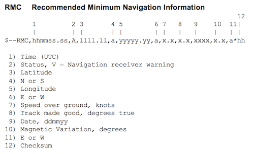
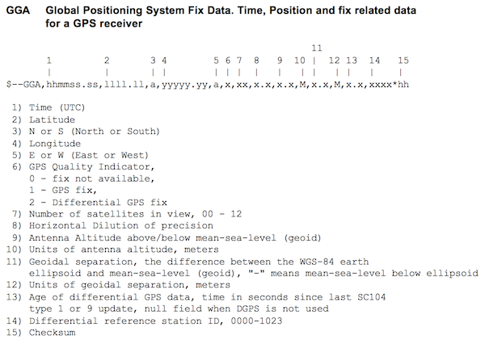
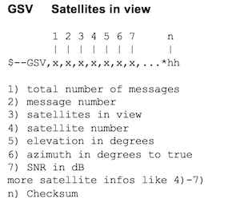
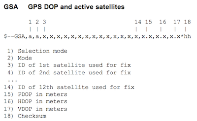

---

title: GPS 資料格式
categories:
  - tech
tags:
  - GPS
  - NMEA
date: 2017-11-02 10:07:32

---


什麼是 NMEA file ？
美國國家海洋電子協會 (National Marine Electronics Association，NMEA) 制定了 GPS 協定標準規格，NMEA 0183 的資料格式中記錄了座標、方位、速度、衛星有效數量等等的資訊。


<!-- more -->

## 資料格式 ##

```text
$ttsss,d1,d2,....
```

以 $ 為起始，ttsss 表示識別符，後面接上以 , 分隔的資料資料區塊，最後由 CR/LF （換行）為結尾。

## 識別符 ##

NMEA 定義了多種 identifier，這裡列出我比較會有用到的：

### GPRMC, Recommended Minimum Navigation Information ###

推薦的最小定位資訊，資料格式為：



> <1> UTC 時間，格式：hhmmss.ss（時分秒）
> <2> 定位狀態，A=有效定位，V=無效定位
> <3> 緯度 ddmm.mmmm（度分）格式（位數不足則補 0）
> <4> 緯度半球 N（北半球）或 S（南半球）
> <5> 經度 dddmm.mmmm（度分）格式（位數不足則補 0）
> <6> 經度半球 E（東經）或 W（西經）
> <7> 地面速率（000.0~999.9節，位數不足則補 0）
> <8> 地面航向（000.0~359.9度，以真北為參考基準，位數不足則補 0）
> <9> UTC 日期，ddmmyy（日月年）格式
> <10> 磁偏角（000.0~180.0度，位數不足則補 0）
> <11> 磁偏角方向，E（東）或W（西）
> <12> 模式指示（僅 NMEA0183 3.00 版本輸出，A=自主定位，D=差分，E=估算，N=資料無效）

#### 經緯度轉換 ####
NMEA 紀錄格式為 `ddmm.mmmm`

> 以 4124.8963 為例
> 先除 100 得到 41.248963
> 將小數點後面運算 除60 乘100 => 0.248963*100/60 = 0.103303
> 再加上先小數點前的值 41+0.103303=41.103303
> 這樣就可在 Google Map 中使用

若要轉換成 Google Map 可用的格式可參考以下程式碼

```js
// Javascript Code
function formatGPS(number, quadrant) {

        if (quadrant == 'W') {
            quadrant_value = -1;
        } else if (quadrant == 'S') {
            quadrant_value = -1;
        } else {
            quadrant_value = 1;
        }

        return (((number/100).toString().split(".")[0])*1 + ("0." + (number/100).toString().split(".")[1])*100/60) * quadrant_value;
    }
```

### GPGGA, Global Positioning System Fix Data. Time, Position and fix related data for a GPS receiver ###

GPS 定位資訊，資料格式為：



> <1> UTC時間，hhmmss.sss（時分秒）格式
> <2> 緯度 ddmm.mmmm（度分）格式（位數不足則補 0）
> <3> 緯度半球 N（北半球）或 S（南半球）
> <4> 經度dddmm.mmmm（度分）格式（位數不足則補 0）
> <5> 經度半球 E（東經）或 W（西經）
> <6> GPS 狀態：0=未定位，1=非差分定位，2=差分定位，6=正在估算
> <7> 正在使用解算位置的衛星數量（00~12）（位數不足則補 0）
> <8> HDOP 水平精度因數（0.5~99.9）
> <9> 海拔高度（-9999.9~99999.9）
> <10> 高度單位，M 表公尺
> <11> 大地橢球面相對海平面的高度（-999.9到9999.9）
> <12> 高度單位，M 表公尺
> <13> 差分 GPS 數據期限（RTCM SC-104），最後設立 RTCM 傳送的秒數量
> <14> 差分參考基站標號，從0000到1023（位數不足則補 0）
> <15> checksum 校驗

### GPGSV, Satellites in view ####

取目前可見到的衛星資訊，資料格式為：



> <1> 收到 GPS 訊息的總數
> <2> 收到 GPS 訊息的編號
> <3> 可見衛星的總數，00 至 12
> <4> 衛星編號，01 至 32
> <5> 衛星仰角，00 至 90 度
> <6> 衛星方位角，000 至 359 度
> <7> 訊號雜訊比（C/No），00 至 99 dB；無表未接收到訊號
> <...> 重複 4 ~ 7，最多四組（用 `[]` 包）
> <8> Checksum 校驗

### GPGSA, GPS DOP and active satellites ####

當前衛星資訊，資料格式為：



> <1> 模式 ：M=手動，A=自動
> <2> 定位型式 1=未定位，2=二維定位，3=三維定位
> <3> 到 <14> 01 ~ 32 表天空使用中的衛星編號，最多可接收12顆衛星資訊
> <15> PDOP 位置精度因數（0.5~99.9）
> <16> HDOP 水平精度因數（0.5~99.9）
> <17> VDOP 垂直精度因數（0.5~99.9）
> <18> Checksum 校驗


## 附加資料 ##

G-Sensor 可幫助 GPS 航位推算，也可記錄當車輛碰到不同事件時所承受的力道

### GSENSORD ###

部分行車記錄器中所存的 NMEA file 會紀錄 G-Sensor 的值，格式如下：
> <1> X 軸 G 值
> <2> Y 軸 G 值
> <3> Z 軸 G 值
