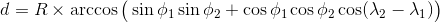
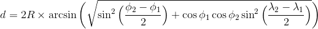

---

title: GPS 簡介
categories: 
  - tech
tags:
  - GPS
  - Datum
  - TWD67
  - TWD97
  - WGS84
  - Haversine
  - Vincenty
date: 2018-04-23 13:07:35

---

GPS 英文全名是：Global Positioning System，全球定位系統

一般來說要表示地理位置都會用座標來標示，實際上用座標是不夠清楚的，因為所指的座標是用什麼基準的並沒有說明。明確的地理位置會用大地基準（Datum）＋坐標格式（Format／Grid）兩個參數來標示。

<!-- more -->

## 大地座標系統（Datum） ##

Datum 是由數學模式所計算出來的地球外形，目前台灣常見的有三種：TWD67、TWD97、WGS84；其中 TWD67 是依據 1967 年的國際地球原子參數所定，以埔里虎子山為測量原點；TWD97 是依據 1980 年的國際地球原子參數而定；WGS84 則是以地球質心為原點，透過遍佈世界的衛星觀測站觀測到的坐標而建立的。

## 座標格式 ##

經緯度在表示時因“度”單位太大，所以將度細分為分＆秒，一度 60 分，一分 60 秒，故有三種表示法：

 - DD 度 : 41.40338, 2.17403
 - DMM 度分 : 41 24.2028, 2 10.4418
 - DMS 度分秒 : 41°24'12.2"N 2°10'26.5"E

## 座標距離 ##

因地球並非正圓體，而是在赤道地區較膨脹＆兩極扁平，呈橢圓體，故在計算兩點距離時並不是這麼好計算。

### 法一： ###

假設地球為圓球體，計算球體上兩個點的距離又稱大圓距離 (The Great Circle Distance)：


可利用 [Great-circle distance](https://en.wikipedia.org/wiki/Great-circle_distance) 公式：


或利用 [Haversine](https://en.wikipedia.org/wiki/Haversine_formula) 公式：


```text
a = sin²(Δφ/2) + cos φ1 ⋅ cos φ2 ⋅ sin²(Δλ/2) 
c = 2 ⋅ atan2( √a, √(1−a) )
d = R ⋅ c
```

#### JS Code ####
```js
function distanceByHaversine(lat1, lon1, lat2, lon2) {
    var R = 6371e3; // metres
    var φ1 = lat1 * Math.PI / 180;
    var φ2 = lat2 * Math.PI / 180;
    var Δφ = (lat2-lat1) * Math.PI / 180;
    var Δλ = (lon2-lon1) * Math.PI / 180;

    var a = Math.sin(Δφ/2) * Math.sin(Δφ/2) +
            Math.cos(φ1) * Math.cos(φ2) *
            Math.sin(Δλ/2) * Math.sin(Δλ/2);
    var c = 2 * Math.atan2(Math.sqrt(a), Math.sqrt(1-a));

    var d = R * c;

    return d;
}
```

#### PHP Code ####

```php
function distanceByHaversine($lat1, $lon1, $lat2, $lon2)
{
    $R = 6371e3; // metres

    $latR1 = $lat1 * pi() / 180;
    $lonR1 = $lon1 * pi() / 180;
    $latR2 = $lat2 * pi() / 180;
    $lonR2 = $lon2 * pi() / 180;

    $x = $latR2 - $latR1;
    $y = $lonR2 - $lonR1;

    $a = sin($x / 2) * sin($x / 2) + cos($latR1) * cos($latR2) * sin($y / 2) * sin($y / 2);
    $c = 2 * atan2(sqrt($a), sqrt(1 - $a));
    $d = $R * $c;

    return $d;
}
```

### 法二： ###

然而地球不是正圓體，如果用上述的方式難免有誤差，因此 Thaddeus Vincenty 在 1975 年提出了 [Vincenty's formula](https://en.wikipedia.org/wiki/Vincenty%27s_formulae) 以用來計算橢圓球體，可精確到 0.5 mm 以內


<table>
<tr>
	<td>a</td>
	<td>橢圓體半長軸長度（赤道半徑）</td>
	<td>6378137.0m（WGS84）</td>
</tr>
<tr>
	<td>ƒ</td>
	<td>扁率</td>
	<td>1/298.257223563（WGS84）</td>
</tr>
<tr>
	<td>b = (1 − ƒ) a</td>
	<td>橢球體半短軸長度（兩極半徑）</td>
	<td>6356752.314245m（WGS84）</td>
</tr>
</table>

#### JS Code ####

```js
function distanceByVincenty(lat1, long1, lat2, long2) {
    var a = 6378137;
    var b = 6356752.314245;
    var f = 1 / 298.257223563;

    var φ1 = lat1 * Math.PI / 180;
    var λ1 = long1 * Math.PI / 180;
    var φ2 = lat2 * Math.PI / 180;
    var λ2 = long2 * Math.PI / 180;

    var L = λ2 - λ1;
    var tanU1 = (1-f) * Math.tan(φ1), cosU1 = 1 / Math.sqrt((1 + tanU1*tanU1)), sinU1 = tanU1 * cosU1;
    var tanU2 = (1-f) * Math.tan(φ2), cosU2 = 1 / Math.sqrt((1 + tanU2*tanU2)), sinU2 = tanU2 * cosU2;

    var λ = L, λʹ, iterationLimit = 100;
    do {
        var sinλ = Math.sin(λ), cosλ = Math.cos(λ);
        var sinSqσ = (cosU2*sinλ) * (cosU2*sinλ) + (cosU1*sinU2-sinU1*cosU2*cosλ) * (cosU1*sinU2-sinU1*cosU2*cosλ);
        var sinσ = Math.sqrt(sinSqσ);
        if (sinσ==0) return 0;  // co-incident points
        var cosσ = sinU1*sinU2 + cosU1*cosU2*cosλ;
        var σ = Math.atan2(sinσ, cosσ);
        var sinα = cosU1 * cosU2 * sinλ / sinσ;
        var cosSqα = 1 - sinα*sinα;
        var cos2σM = cosσ - 2*sinU1*sinU2/cosSqα;
        if (isNaN(cos2σM)) cos2σM = 0;  // equatorial line: cosSqα=0 (§6)
        var C = f/16*cosSqα*(4+f*(4-3*cosSqα));
        λʹ = λ;
        λ = L + (1-C) * f * sinα * (σ + C*sinσ*(cos2σM+C*cosσ*(-1+2*cos2σM*cos2σM)));
    } while (Math.abs(λ-λʹ) > 1e-12 && --iterationLimit>0);
    if (iterationLimit==0) throw new Error('Formula failed to converge');

    var uSq = cosSqα * (a*a - b*b) / (b*b);
    var A = 1 + uSq/16384*(4096+uSq*(-768+uSq*(320-175*uSq)));
    var B = uSq/1024 * (256+uSq*(-128+uSq*(74-47*uSq)));
    var Δσ = B*sinσ*(cos2σM+B/4*(cosσ*(-1+2*cos2σM*cos2σM)-
        B/6*cos2σM*(-3+4*sinσ*sinσ)*(-3+4*cos2σM*cos2σM)));

    var s = b*A*(σ-Δσ);

    var fwdAz = Math.atan2(cosU2*sinλ,  cosU1*sinU2-sinU1*cosU2*cosλ);
    var revAz = Math.atan2(cosU1*sinλ, -sinU1*cosU2+cosU1*sinU2*cosλ);

    return s
}
```

#### PHP Code ####

```php
function distanceByVincenty($lat1, $long1, $lat2, $long2)
{
    $a = 6378137;
    $b = 6356752.314245;
    $f = 1 / 298.257223563;
    $L = deg2rad($long2 - $long1);

    $tanU1 = (1 - $f) * tan(deg2rad($lat1));
    $cosU1 = 1 / sqrt(1 + $tanU1 * $tanU1);
    $sinU1 = $tanU1 * $cosU1;

    $tanU2 = (1 - $f) * tan(deg2rad($lat2));
    $cosU2 = 1 / sqrt(1 + $tanU2 * $tanU2);
    $sinU2 = $tanU2 * $cosU2;

    $lambda = $L;
    $iterLimit = 100;
    do {
        $sinLambda = sin($lambda);
        $cosLambda = cos($lambda);
        $sinSigma = sqrt(($cosU2 * $sinLambda) * ($cosU2 * $sinLambda) + ($cosU1 * $sinU2 - $sinU1 * $cosU2 * $cosLambda) * ($cosU1 * $sinU2 - $sinU1 * $cosU2 * $cosLambda));
        if ($sinSigma == 0) {
            return 0;
        }
        $cosSigma = $sinU1 * $sinU2 + $cosU1 * $cosU2 * $cosLambda;
        $sigma = atan2($sinSigma, $cosSigma);
        $sinAlpha = $cosU1 * $cosU2 * $sinLambda / $sinSigma;
        $cosSqAlpha = 1 - $sinAlpha * $sinAlpha;
        if ($cosSqAlpha == 0) {
            $cos2SigmaM = 0;
        } else {
            $cos2SigmaM = $cosSigma - 2 * $sinU1 * $sinU2 / $cosSqAlpha;
        }
        $C = $f / 16 * $cosSqAlpha * (4 + $f * (4 - 3 * $cosSqAlpha));
        $lambdaP = $lambda;
        $lambda = $L + (1 - $C) * $f * $sinAlpha * ($sigma + $C * $sinSigma * ($cos2SigmaM + $C * $cosSigma * (-1 + 2 * $cos2SigmaM * $cos2SigmaM)));
    } while (abs($lambda - $lambdaP) > 0.000000000001 && --$iterLimit > 0);
    if ($iterLimit == 0) {
        return 0;
    }
    $uSq = $cosSqAlpha * ($a * $a - $b * $b) / ($b * $b);
    $A = 1 + $uSq / 16384 * (4096 + $uSq * (-768 + $uSq * (320 - 175 * $uSq)));
    $B = $uSq / 1024 * (256 + $uSq * (-128 + $uSq * (74 - 47 * $uSq)));
    $deltaSigma = $B * $sinSigma * ($cos2SigmaM + $B / 4 * ($cosSigma * (-1 + 2 * $cos2SigmaM * $cos2SigmaM) - $B / 6 * $cos2SigmaM * (-3 + 4 * $sinSigma * $sinSigma) * (-3 + 4 * $cos2SigmaM * $cos2SigmaM)));
    return $b * $A * ($sigma - $deltaSigma);
}
```


