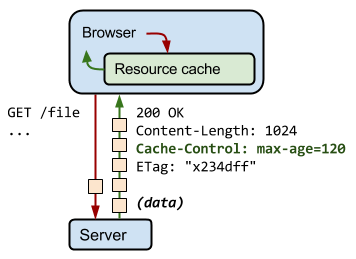

---

title: HTTP Caching
categories: 
  - tech
tags:
  - HTTP
  - Cache
  - Cache-Control
  - ETage
date: 2018-02-01 15:02:39

---


近年來 Web 的服務越來越多樣化，其中不乏較大流量的服務，不僅增加傳輸的成本，也會拖慢 Browser 處理的時間，因此需要重複的利用之前所緩存的資源。

## Caching 機制 ##

那就讓我們來看看 Caching 的機制是什麼

在規範（[https://tools.ietf.org/html/rfc7234](https://tools.ietf.org/html/rfc7234)）中將其分為 4.2. Freshness 和 4.3. Validation 

<!-- more -->

### Freshness ###
Cache Control & Expires 用來確認本地端的檔案是否過期，若是沒有過期則可以不需向 Server 驗證就可直接使用，就可以避免網路造成的延遲及傳輸成本。

> 補充說明：  
> 在 HTTP1.0 中定義了 `Expires`，Expires 的值是一個明確的過期時間，但這會碰到一個問題，因為 Expires 的時間是本地的時間，可能會與 Server 的不一致。
> 因此在 HTTP1.1 中新添加了 `Cache-Control`，實現了更完整的 Caching 聲明；如 max-age 配置，用來表示檔案多久過期，而不是直接表示過期時間。  
> 假設設定值為：`Cache-Control: max-age=30`，在當前 Request 的 30 秒之內再次請求，則會取用 Cache，超過則會再次發送 Request。  
> 而根據 [RFC2616](https://www.w3.org/Protocols/rfc2616/rfc2616-sec14.html#sec14.9.3) 的定義：`max-age` 會蓋過 Expires。
>> If a response includes both an Expires header and a max-age directive, the max-age directive overrides the Expires header, even if the Expires header is more restrictiv

### Validation ###
Last-Modified & ETag 則是用來確認本地端的檔案是否與 Server 端的檔案符合，在 Browser 判斷 Cache 可能過期後則會向 Server 驗證檔案的一致性，若驗證通過則 Server 回覆 HTTP Status Code 304，否則返回 200 並回覆新的內容。

> 補充說明：
> 在 HTTP1.0 中定義了 `Last-Modified`，當 Server 端回覆的 Response 中含有 Last-Modified（表示這個檔案的最後一次更新時間），則下次 Client 端送出的 Request 中為了要驗證是否有更新則會夾帶 `If-Modified-Since`（上次收到的 Last-Modified 值）給 Server 判斷。但 Last-Modified 還是有需要加強的地方，像是用時間來紀錄更新的狀態，但卻不代表檔案真的被更新過，另外時間的單位只有到秒，也不足代表。  
> 在 HTTP1.1 增加了 `Etag`，是利用類似 hash 的原理，來代表檔案是否一致，與 `If-None-Match` 標籤對應，但 Etag 在部分使用情境上還是會有問題，像是 Apache 中的 ETag 是用 inode、檔案大小和最後修改時間來產生的，在有負載平衡架構下，不同機器就會產生出不一樣的 ETag，但由於一般來說都會使用 CDN 技術，就交由專業的處理了。


主要就是透過 Freshness & Validation 這兩個機制來去做 Caching，以下舉個例子來了解一下吧：（為了方便理解，裡面的 Key & Value 並非實際數值）

假設我第一次跟某個網站要了一張圖得到的回覆是（2018-01-01 13:00:00）

```text
Response Header
Cache-Control: max-age=30day
Last-Modified: 2017-12-25 10:00:00
ETag: validation_key
```

收到後就將其存進本地 Cache，在 10 天後我再次訪問這張圖片時，Browser 告訴我：『本地就有存擋了喔，直接給你吧』，於是就不發送請求，直接取用  Cache，Browser 會回應 `200 OK (form disk cache)`

然後又過了一個月後我再次去看了這張圖，這次 Browser 發現已經過期了，所以它就送了 Request 去問 Server 這張圖從 2017-12-25 10:00:00 後有沒有更新

```text
Request Header
If-Modified-Since: 2017-12-25 10:00:00
If-None-Match: validation_key
```

要是更新了，Server 就會回覆 HTTP Status Code 200 並給予新的檔案
若是沒有更新則 Server 會回覆 `304 Not Modified`，就繼續拿本地的 Cache 來用

介紹完了概念後，來補充一些細部的解釋吧～

## Cache-Control ##

最快的連線就是不要連線，透過本地的緩存，減少不必要的成本，這就要透過 Cache-Control 的設定了



### no-cache & no-store ###

* no-cache 表示必須要跟 Server 確認檔案的一致性，不論過期與否，若驗證（ETag）通過，則可直接存取本地緩存
* no-store 就更加簡單了，就是禁止在本地儲存任何的緩存，每次的請求都會由 Server 給予完整的回應

### public & private ###

* public 表公開資訊，可被緩存，但通常不另外設定
* private 表私人資訊，不允許中繼快取（如 CDN）

### max-age ###
表示從請求後開始可緩存的時間（秒）

## HTTP Status 200 OK (form disk cache) 與 304 Not Modified ##

先來了解什麼是  200 OK (form disk cache) 與 304 Not Modified

* 200 OK (form disk cache)：
是表示 Browser 沒有跟 Server 確認，就直接使用了本地的 cache
* 304 Not Modified：
是表示 Browser 跟 Server 確認 cache 的可用性後再使用

## Cache 的更新及作廢 ##
依照上面的機制，當 Client Caching 後就只能等它到期後再更新成 Server 上的內容，但是若是我想要 patch 怎麼辦呢？最簡單的方式就是變更請求的位置  
但如果我們沒有辦法變更呢？很抱歉，只能告訴你，做不到了...  
所以我們可以設想一下如何才能設計一個魚與熊掌兼得的架構呢？  

其實我們只要混用剛剛所說的就可以了，參考下面的圖例


我們藉由給予每個不同的資源不同的快取策略，定義 “快取階層”，如此一來，同時達成用戶端快取和快速更新。

* HTML 標記為 `no-cache`，這表示瀏覽器在每次請求時都會重新驗證文件，如果內容變更，就會拿到最新版本。同時，在 HTML 標記中，我們在 CSS 和 JavaScript 資源的網址中嵌入指紋碼：如果這些檔案的內容變更，網頁的 HTML 也會隨之變更，並將下載 HTML 回應的新副本。
* 允許瀏覽器和中繼快取 (例如 CDN) 快取 CSS，期限設定為 1 年。請注意，我們可以放心使用 1 年的「遠期期限」，因為我們在檔案名稱中嵌入了檔案指紋碼：如果 CSS 更新，網址也會隨之變更。
* JavaScript 期限也設定為 1 年，但是被標記為「private」，也許是因為其中包含了不適合 CDN 快取的使用者私人資料。
* 快取圖片時不包含版本或唯一指紋碼，期限設定為 1 天。

## 參考資料 ##

* [HTTP 快取 - Google Web Developers](https://developers.google.com/web/fundamentals/performance/optimizing-content-efficiency/http-caching?hl=zh-tw)
* [循序漸進理解 HTTP Cache 機制 - TechBridge 技術共筆部落格](https://blog.techbridge.cc/2017/06/17/cache-introduction/)


