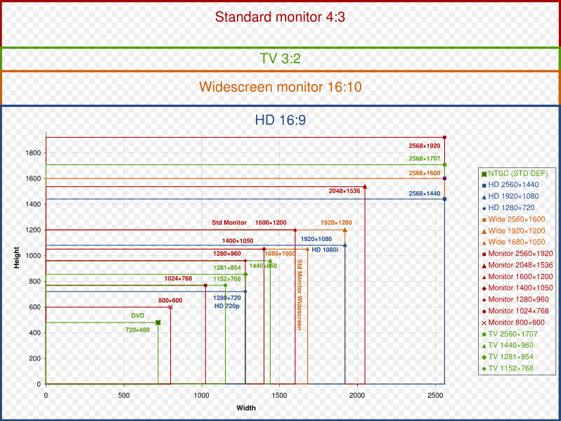
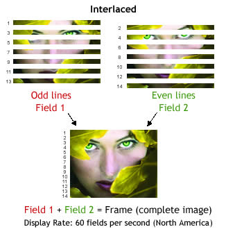
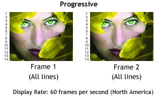

---

title: 多媒體基本概念
categories: 
  - tech
series:
  - media
tags:
  - FFmpeg
  - streaming
date: 2017-12-29 20:04:58
draft: true

---

影音的世界包含了許多的知識，在進入這領域之前，我就是一張白紙，到現在仍是懵懂，希望可以藉由紀錄及分享讓我自己或其他人獲得更多

本篇記錄了一些我覺得基本要知道的名詞及解釋，深入的部份會再另開篇章來說

## Resolution ##

解析度目前主流的有720P（高清）、1080i、1080P（全高清）、2K（2560x1440）、4K（3840×2160）

720 & 1080 代表的是畫面的高度，而畫面的比例大多是 16:9 ，所以換算的結果就是 1280x720 & 1920x1080

而數字後的 P 又代表什麼呢？
P 就是 Progressive Scan（循序掃瞄），I 就是 Interlace Scan（交錯掃瞄）

## Framerate ##
「Frame Rate」是指影片每秒播放靜態畫面的數量。比較常見的規格有 PAL 與 SECAM 的 25fps 及 NTSC 的 29.97 fps。有些電玩畫面的 Frame Rate 會高達 60，甚至上百，如果不特別處理，在網路上播放時會因為傳輸速度及 CPU 處理能力趕不上，而會有掉格的現象。

## Bitrate ##
「Bit Rate」是指單位時間播放壓縮後影片的位元數量，它相當於影片播放時的頻寬消耗量，以多少 Kbps 或 Mbps 為單位。可以想像的是，較高的 Bit Rate 可容納更高的視訊品質，但與「解析度」有其相配性。以 480p 配 500kbps 及 720p 配 800kbps，在電腦銀幕上的觀看效果是不錯的，也同時兼顧了頻寬成本及符合大多數網友可以順暢收看的網路環境！

Drop Frame 丟棄影格(少計算時間碼模式)，NTSC 才有

I畫格（I frames）、P畫格（P frames）和B畫格（B frames）

VBR、ABR、CBR、CQ、CRF

基本概念：
I frame ：幀內編碼幀又稱intra picture，I 幀通常是每個 GOP（MPEG 所使用的一種視頻壓縮技術）的第一個幀，經過適度地壓縮，做為隨機訪問的參考點，可以當成圖像。I幀可以看成是一個圖像經過壓縮後的產物。
P frame:前向預測編碼幀又稱 predictive-frame，通過充分將低於圖像序列中前面已編碼幀的時間冗餘信息來壓縮傳輸數據量的編碼圖像，也叫預測幀；
B frame: 雙向預測內插編碼幀又稱bi-directional interpolated prediction frame，既考慮與源圖像序列前面已編碼幀，也顧及源圖像序列後面已編碼幀之間的時間冗餘信息來壓縮傳輸數據量的編碼圖像，也叫雙向預測幀；
PTS：Presentation Time Stamp。PTS主要用於度量解碼後的視頻幀什麼時候被顯示出來
DTS：Decode Time Stamp。DTS主要是標識讀入內存中的ｂｉｔ流在什麼時候開始送入解碼器中進行解碼。
在沒有B幀存在的情況下DTS的順序和PTS的順序應該是一樣的。

ＩＰＢ幀的不同：
I frame:自身可以通過視頻解壓算法解壓成一張單獨的完整的圖片。
P frame：需要參考其前面的一個I frame 或者B frame來生成一張完整的圖片。
B frame:則要參考其前一個I或者P幀及其後面的一個P幀來生成一張完整的圖片。
兩個I frame之間形成一個GOP，在x264中同時可以通過參數來設定bf的大小，即：I 和p或者兩個P之間B的數量。
通過上述基本可以說明如果有B frame 存在的情況下一個GOP的最後一個frame一定是P.
DTS和PTS的不同：
DTS主要用於視頻的解碼,在解碼階段使用.PTS主要用於視頻的同步和輸出.在display的時候使用.在沒有B frame的情況下.DTS和PTS的輸出順序是一樣的.

音频帧概念详解
http://www.voidcn.com/article/p-oagwbhda-tg.html

為什麼電影 24 格就行，但遊戲卻要 60 格？
http://technews.tw/2015/10/21/talk-about-fps/

技術專欄：線上影音播放的最大挑戰及因應(一)
http://www.onevision.com.tw/blog/index.php/01/12/%E6%8A%80%E8%A1%93%E5%B0%88%E6%AC%84%EF%BC%9A%E7%B7%9A%E4%B8%8A%E5%BD%B1%E9%9F%B3%E6%92%AD%E6%94%BE%E7%9A%84%E6%9C%80%E5%A4%A7%E6%8C%91%E6%88%B0%E5%8F%8A%E5%9B%A0%E6%87%89%E4%B8%80/

標準 Frame Rate 影格率
http://wellswoo.pixnet.net/blog/post/202413619-%E6%A8%99%E6%BA%96-frame-rate-%E5%BD%B1%E6%A0%BC%E7%8E%87