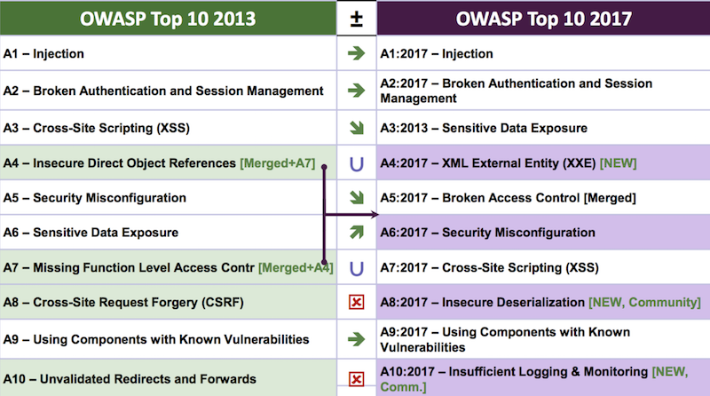

---

title: OWASP Top 10 2017
categories: 
  - tech
tags:
  - OWASP
date: 2017-11-21 16:04:35

---

這禮拜一去參加了 OWASP 2017 的研討會，其中提到了新發佈的 OWASP Top 10 2017版；先回頭來談一下什麼是 OWASP，在開發系統時，除了功能以外，安全也是必須要著重且注意的，在快速開發的過程中，常常會沒有兼顧到安全這塊；對於部分各戶來說，在還未出包之前大概也不會感覺到資安的重要；OWASP 就統整了十大弱點排名（當然啦～不是只有這十個需要重視）， 最近的一次正式更新是在 2013 年，在這過程中資訊的進步很快，排名也略有變動。

在研討會中也提到了最新的 OWASP Top 10 2017，與 2013 年比較第一名依舊是 Injection，第二名是身份驗證；然而新版的因考慮了現在的系統採用了許多的 API 讓前後端分離，也搜集了實際企業的 Log 數據，可以從排名中看出都跟最近流行的微服務有關。

<!-- more -->

## Top 1: Injection ##
**Injection（注入攻擊）**

將不安全的數據傳送到解析器中，當作指令（Command）或查詢（Query），產生如 SQL Injection、LDAP Injection 等等的 Injection 缺陷。攻擊者就可以用惡意的資料欺騙解析器，進而達到竄改資料或執行非預期的指令。

## Top 2: Broken Authentication and Session Management ##
**Broken Authentication and Session Management（無效身分認證和 Session 管理）**

許多系統常會需要身份驗證才能操作，但要是導入方式不正確，反而可能被有駭客取得駭客取得密碼、金鑰、Session 令牌，用來冒用其他用戶身份。

## Top 3: Sensitive Data Exposure ##
**Sensitive Data Exposure（敏感資料外洩）**

許多系統常會牽涉到一些敏感資料，如個人資料、金融資訊、醫療保健數據等等，若是對資料的保護不足，就可能被駭客取得，進而造成身份偽造、盜竊等行為，固對這些敏感數據應做額外的加密保護，不論是在傳輸的過程中、儲存、瀏覽器瀏覽的過程中都是。

## Top 4: XML External Entity(XXE) ##
**XML External Entity(XXE)（XML外部處理器漏洞）**

XXE 漏洞發生在程式解析 XML 輸入時，沒有禁止外部實體的載入。在以 XML 為基礎的服務中若沒有管控權限，直接接受 XML 的請求，就有可能被惡意的 XML 文件影響，導致敏感數據被竊取、遠程代碼執行、取得機器上檔案的存取權、DoS（阻斷式服務）、掃描內網等等。

## Top 5: Broken Access Control ##
**Broken Access Control（無效的存取控管）**
Insecure Direct Object References & Missing Function Level Access Control

是由 2013 年的 Insecure Direct Object References 和 Missing Function Level Access Control 合併而來；系統需對用戶的身份做適當的存取管控，駭客會利用控管的漏洞去存取沒有經過授權的功能或察看敏感資料、修改使用者數據、更改訪問權限等。

## Top 6: Security Misconfiguration ##
**Security Misconfiguration（不安全的組態設定）**

一般來說都是開發者使用了不安全的設定值，像是 HTTP  header、AWS S3 bucket 權限控管等等，系統的設定也要跟版本和漏洞配合，確保系統安全無虞。

## Top 7: Cross-Site Scripting(XSS) ##
**Cross-Site Scripting(XSS)（跨站腳本攻擊）**

當應用程式未將使用者提供的資料先審核或進行內容編碼，就直接將資料傳輸到網路瀏覽器，即可能發生 XSS 問題。XSS 能讓攻擊者直接在受害者的網路瀏覽器上執行 Script，攻擊者便可以綁架用戶的 Session 或竄改網站內容等。
XSS 一直是是網站攻擊排行榜上有名的，有太多種可能性可以執行 JavaScript，只要有一點機會就會讓駭客有機可趁。

## Top 8: Insecure Deserialization ##
**Insecure Deserialization（不安全的反序列化漏洞）**

當系統收到惡意的序列化物件時（如 JSON、XML），在反序列化時會出現不安全缺陷，駭客可透過這個過程竄改變數或更甚於影響到程式執行。

## Top 9: Using Components with Known Vulnerabilities ##
**Using Components with Known Vulnerabilities（使用已有漏洞的元件）**

現今的開發常會用到現成的元件、套件、Framework，要時常確認現在的版本有無缺陷或更新。

## Top 10: Insufficient Logging & Monitoring ##
**Insufficient Logging & Monitoring（紀錄與監控不足風險）**

完整 Log 紀錄及監控能夠讓我們更了解系統在運行的過程中是否正常，是否有駭客入侵或竄改系統的紀錄，在會議中也提到，依數據顯示：大多數的缺陷被檢測出的時間超過 200 天，顯示了紀錄與監控不足。

## 同場加映： ##
**Cross-Site Request Forgery(CSRF)（跨站請求偽造）**

跨站請求攻擊，簡單地說，是攻擊者通過一些技術手段欺騙用戶的瀏覽器去訪問一個自己曾經認證過的網站並執行一些操作（如發郵件，發消息，甚至財產操作如轉帳和購買商品）。由於瀏覽器曾經認證過，所以被訪問的網站會認為是真正的用戶操作而去執行。這利用了 Web 中用戶身份驗證的一個漏洞：簡單的身份驗證只能保證請求發自某個用戶的瀏覽器，卻不能保證請求本身是用戶自願發出的。

另外若是對於 OWASP Top 10 有任何的建議或疑問都可以到官方的 GitHub，上面也紀錄了歷年來的版本 - [https://github.com/OWASP/Top10](https://github.com/OWASP/Top10 "https://github.com/OWASP/Top10")

