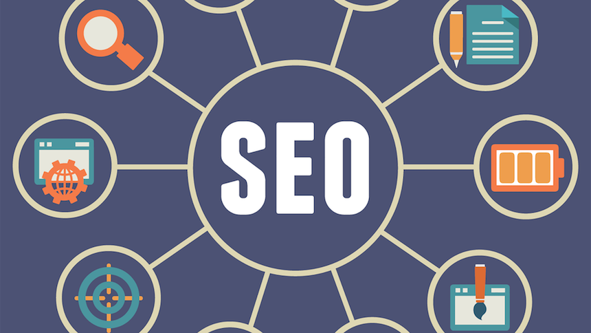

---

title: 淺談 SEO
categories: 
  - tech
tags:
  - SEO
date: 2017-10-20 16:04:35

---

SEO 是什麼呢？它的全稱是 Search Engine Optimization（搜尋引擎優化）。

要如何優化呢？其實就是想辦法讓各家的搜尋引擎看懂你的網站；當然內容正確是基本的，搜尋引擎就像一個圖書館一樣，當書目很大量時就得依靠索引、關鍵字等等的輔助去找到書籍，依照大綱、標題等等的去找到正確的內容。再來就是要針對各家的演算法去做強化，但不建議過度針對演算法優化，把內容做好＆標籤打對才是基本功。

<!-- more -->

網路上也有不少的系列文可以讓大家更了解 SEO，這裡就針對我所做的優化來敘述。

## 內容為王 ##

* 製作網站的目的是什麼？用戶到你的網站的目的是什麼？當內容吸引人，品質好，訪客就會在網站內多停留幾秒，也會吸引到更多的人來，其餘的優化都不如內容來得更重要。
* 關鍵字，盡量利用常見的 keyword 以利訪客或搜尋引擎 parser
* 標籤運用：把關鍵字放在 Title、H1、H2、URL 等等

## UI / UX ##

* 讓用戶有更好的體驗，這範圍涵蓋的很廣，影響到的不只有用戶的感覺，也影響到 SEO 的排序，像是網站速度＆內容的呈現都是，但是切記不要本末倒置，搜尋引擎會不斷的更新演算法以找到更好用戶體驗的網站，所以一昧地去迎合當前的演算法是治標不治本的，反倒還有可能被服務提供商封鎖。
* 網站速度：資源壓縮，如圖檔＆JS 等等的都可以先壓縮成適當的大小，可以增加載入速度及提升用戶體驗，有效降低跳出率。
* Responsive Web，可以針對不同的用戶給予適當的 UI。

## HTTPS ##

* 近幾年 Google 在極力大推網路安全，相對的也會同時反應到 SEO 上。
* 什麼是 HTTPS 呢？是表示網站有沒有裝 SSL，若是有的話在瀏覽器上就會出現綠色勾勾，在 HTTP 的傳輸之中是沒有經過加密的，但 HTTPS 就不同了，HTTPS 會經過加密保護，雖然不是絕對安全，但就像上了鎖一樣，多個防護。
* 那麼我們有了 HTTPS 還需要注意什麼呢？首要的當然是 `301 轉址`，畢竟都用了 HTTPS 也希望用戶都是用較安全的方式，也要告訴各搜尋引擎我們搬家了。

## 網站地圖 ##

* 在我們製作玩內容以後，當然會希望可以給人知道我們更新了什麼，甚至畫出地圖，讓人可以知道我們葫蘆裡有哪些藥，那我們就可以透過以下的方式告訴搜尋引擎我們有哪些內容：
* 可藉由 SiteMap 告訴搜尋引擎我們的網站內容架構，可避免爬蟲沒有讀到網頁的完整內容。
* atom.xml 提供動態消息給用戶或搜尋引擎
* robots.txt 用來跟搜尋引擎溝通的文件

## 結構化數據標記 ##

為了讓電腦也能看得懂我們所寫的內容，我們可以藉由 結構化標記 來讓搜尋引擎知道所代表的涵意，而標記有很多方法，像是 FB 用的是 `Open Graph`，而 Google 所用的是 `JSON‐LD`

## AMP ##

[AMP](https://www.ampproject.org/) 是由 Google 所提出的 Accelerate Mobile Pages，可讓網頁速度大幅上升，改善使用者體驗

## PWA ##

[PWA](https://developers.google.com/web/progressive-web-apps/) 全名是 Progressive Web App，目標是讓 Web 逐步地擁有 APP 的優點，徹底改善用戶體驗

## 各家評測數據加強 ##

也可藉由線上的服務幫我們的網站健檢

[測試行動網站效能 - Google](https://testmysite.thinkwithgoogle.com/ "測試網站效能 - Google")

[行動網站相容性測試 - Google](https://search.google.com/test/mobile-friendly "行動網站相容性測試 - Google")

[PageSpeed Insights - Google](https://developers.google.com/speed/pagespeed/insights/ "PageSpeed Insights - Google")

[Google Search Console](https://www.google.com/webmasters/tools/home?hl=zh-TW "Google Search Console")

[SEO Site Checkup](https://seositecheckup.com/
 "SEO Site Checkup")

[Website Grader](https://website.grader.com/ "Website Grader")

## 參考資料 ##

[SEO教學系列](http://www.inboundjournals.com/what-is-seo/)

[Harris先生 – SEO 基礎教學](http://www.yesharris.com/category/seo-basic/)

[搜尋引擎最佳化指南（官方釋出文件）](http://static.googleusercontent.com/media/www.google.com/en/us/intl/zh-tw/webmasters/docs/search-engine-optimization-starter-guide-zh-tw.pdf)

