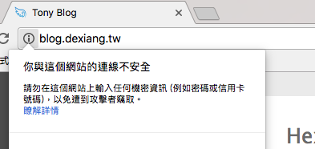
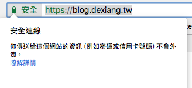
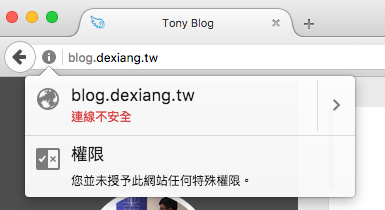
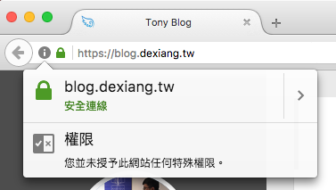

---

title: 簡介 HTTP & HTTPS & HTTP2 協定
categories: 
  - tech
tags:
  - http
  - https
  - http2
  - TCP
  - ssl
  - tls
date: 2017-03-03 18:03:43

---

科技來自於人性，知識的傳遞原本是透過書本或口述，但是當網路出現後，人們想要在上傳遞資訊，就得要制定出一些規則，經過不斷修改，最後總結成了一個協定，把它命名為 HyperText Transfer Protocol。

## HTTP ##

一種網路傳輸協定，全名是：HyperText Transfer Protocol，設計初衷是為了傳輸 HTML，中間也推出了數個版本，現今最被廣泛使用的是 HTTP1.1。

### HTTP 進程 ###

> - HTTP/0.9：已過時。只接受GET一種請求方法，沒有在通訊中指定版本號，且不支援請求頭。由於該版本不支援POST方法，因此用戶端無法向伺服器傳遞太多資訊。
> - HTTP/1.0：這是第一個在通訊中指定版本號的HTTP協定版本，至今仍被廣泛採用，特別是在代理伺服器中。
> - HTTP/1.1：持久連線被預設採用，並能很好地配合代理伺服器工作。還支援以管道方式在同時傳送多個請求，以便降低線路負載，提高傳輸速度。
>
> ※ 引述自 [維基百科](https://zh.wikipedia.org/wiki/%E8%B6%85%E6%96%87%E6%9C%AC%E4%BC%A0%E8%BE%93%E5%8D%8F%E8%AE%AE)

<!-- more -->

### HTTP & TCP ###

HTTP 是基於 TCP 協定，由 Client 發起，預設走 80 Port。
在網路分層中由上而下依序是應用、表現、會議、傳輸、網路、鏈結、實體， TCP 是傳輸層協定，HTTP 是應用層，也就是說這是不一樣的東西，TCP 是解決數據如何在網路傳輸，HTTP 是解決如何包裝數據。

### HTTP keep-alive ###

在 HTTP/1.0 的時候預設的方式是沒有 keep-alive，每一次的連線都是獨立的，在 HTTP/1.1 的時候 keep-alive 是預設開啟的，當多個 request 到同一台時會使用同一個 TCP 連線來傳送和接收，因開關 TCP 連線是有時間成本和 CPU 成本的，如此一來可獲得低網路阻塞和優化效能等等的好處。

## Why HTTPS? ##

資訊安全無疑是近幾年討論的話題之一，不論是企業或是個人都需要“保密防諜”，且在 Chrome 56 開始會將網頁的安全資訊直接顯示在網址列，綠色勾勾就跟一個認證一樣，而後 Firefox 51 也跟進這個機制。

## HTTPS ##

全名是：Hyper Text Transfer Protocol over Secure Socket Layer，是 Netscape 在 1994 年創建，簡單來說 HTTPS 就是 HTTP 的加強版，在 HTTP 上增加了 SSL/TLS 的協定。原本在 HTTP 上的傳遞是明碼的，不加密的狀態下可能有幾項風險：

1. 竊聽風險（eavesdropping）：第三方可以獲知通信內容。
2. 篡改風險（tampering）：第三方可以修改通信內容。
3. 冒充風險（pretending）：第三方可以冒充他人身份參與通信。

所以就基於 HTTP 再加上了加密的協議，SSL/TLS 協議是為了解決這三大風險而設計的，希望達到：

1. 所有信息都是加密傳播，第三方無法竊聽。
2. 具有校驗機制，一旦被篡改，通信雙方會立刻發現。
3. 配備身份證書，防止身份被冒充。

### SSL & TLS ###

SSL 全名：Secure Sockets Layer，是由 NetScape 所設計，經過了多次的修改而廣泛被應用，之後 IETF 將 SSL 進行標準化，並改名為 TLS，全名為：Transport Layer Security。

### 對稱加密 & 非對稱加密 & HASH ###

- 對稱加密：加密和解密使用同一個金鑰的加密演算法。
- 非對稱加密：需兩個金鑰來進行加密和解密，分別是公鑰 (public key) 和私鑰 (private key)。
- HASH：也稱為雜湊。MD5雜湊演算法可以將任意長度的資料經由運算之後，得到一組固定長度為 128 位元 (32 個十六進制數字) 的結果，我們可以使用這個結果當作檢查碼 (Checksum)。

### 運作原理 ###

用對稱加密來加密網頁，用非對稱加密來保護對稱加密的金鑰，這樣互補了兩個演算法的缺點。那麼如何保證非對稱加密的公鑰不被篡改呢？ 只要將公鑰放在數位證書中，只要證書是可信的，公鑰就是可信的。因此，SSL/TLS協議的基本過程是這樣的：

1. 客戶端向伺服器端要求並驗證非對稱加密算法的公鑰。
2. 雙方協商生成對稱加密算法的 “對話密鑰”。
3. 雙方採用對稱加密算法和它的 “對話密鑰” 進行加密通信。

上面過程的前兩步，又稱為 “握手階段” (handshake)。

感覺越寫越多，但這篇只是淺談，所以先講到此，有機會再開一篇來細說。

## Why HTTP2? ##

前面說了 HTTP & HTTPS 通訊協定是全球資訊網 (WWW) 的基礎，在 Internet 上佔了很大一部分，這幾十年網路生態的改變，成長之快，數量之多，任何一點點的效能速度都足以產生巨大影響。在這久未更新的協定中缺點也就越來越明顯了。以下有幾個參考可以觀察出 HTTP2 在速度上的優異：

- [Akamai：HTTP1.1 VS HTTP2](https://http2.akamai.com/demo)
- [HTTP/2 TECHNOLOGY DEMO](http://www.http2demo.io/)

## HTTP2 ##

前面說了 HTTP & HTTPS 通訊協定是全球資訊網 (WWW) 的基礎，而HTTP2 是自 1999 年 HTTP1.1 以來最重要的一次升級，主要目的是為了改善網頁的下載速度， 目前各大瀏覽器包括 Chrome、Safari、Firefox、IE/Edge 都已經支援 HTTP2。

隨著網頁的內容越來越複雜，有時候甚至於一個網站數十或數百個 request 到 server。在 HTTP1.1 時，每一個請求都必須佔用一個連線 (TCP connection)，為了加速網站只好開多個連線併發請求。而在 HTTP2 改善了這一點，差別如下：

- 連線多工 (Multiplexing)，在單一網路連線上，就可以同時傳輸多個 HTTP Request 和 Response，併發請求 CSS/JS/Images 等等資源。它的原理是將 Requests/Responses 都拆碎成小的 frames 進行傳輸，且這些 frames 是可以交錯的，因此檔案再多也不怕，不會發生佔用網路連線 (TCP connection) 的情況。也只需要單一連線就可以處理。
- 可決定檔案優先順序
- Header 壓縮

### 需要 HTTPS ###

要先擁有 TLS/SSL 安全性憑證，除了有更快速度，同時也要求了更好的網路安全。

## 後記 ##

其實在寫這篇的過程中，好幾度煞不住車，越寫越細，包括各個協定的細節、原理還有延伸出去的技術，甚至於實作的部分，導致於篇幅越來越大，但是怕這篇會變成大雜燴，就只好先簡述個大概了，待以後再補完各個的細節及實作。