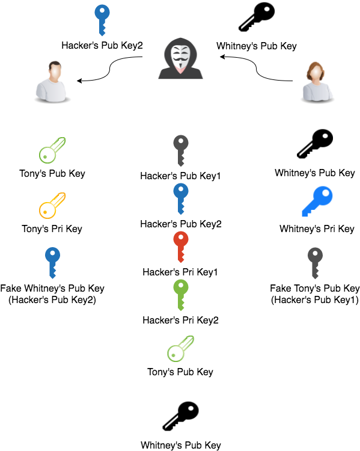

---

title: 密碼學簡介
categories: 
  - tech
tags:
  - cryptography
  - 對稱加密
  - Symmetric Encryption
  - 非對稱加密
  - Asymmetric encryption
  - 數位簽章
  - Signature
  - PKI
  - X.509
  - CA
date: 2018-05-10 17:01:32
libraries:
  - katex

---

在傳遞資料的時候，若是不希望別人看到，那麼我們就會把內容做適當的處理。在現實生活中其實隨處可見密碼學的概念，我們就來想像以下的情境吧。

> Tony 想傳情書給 Whitney，但不想給別人看到，他們會怎麼做呢？

## 對稱加密（Symmetric Encryption） ##

> 一開始他們就把信交給郵差之前，將它裝到盒子裡上鎖，各拿一把鑰匙，透過郵差拿到盒子後再把鎖打開

對稱加密，溝通雙方拿著一樣的金鑰，有鑰匙的人就可以自由開關，而沒有鑰匙的人就算拿到保險箱也打不開，常見的有：DES、AES

<!-- more -->

## 非對稱加密（Asymmetric encryption） ##

> 但是這又有一個問題了，當他們分隔兩地時，第一次要怎麼傳遞鑰匙呢？要是不小心被別人拿去了呢？所以他們就找了一個特製的鎖（如下圖），一把鑰匙只可以從 A 轉到 C（\\(K_p\\)），另一把只能從 C 到 A（\\(K_s\\)）。
>
> 一開始 Tony 會把 \\(K_p\\) 寄給 Whitney，然後再把上鎖的盒子給她，Whitney 收到盒子後就可以用 \\(K_p\\) 打開。
>
> 這樣的方法就算 \\(K_p\\) 流出，在傳遞的過程中也無法變造內容，因為需要 \\(K_s\\) 才能完整操作盒子。

非對稱式加密會有兩個金鑰，通常給出去的稱作公鑰（\\(K_p\\)），留在本地的稱做私鑰（\\(K_s\\)），加解密是需要兩組配合才能運作。用私鑰加密，就要用公鑰解密；用公鑰加密就用私鑰解密。

而實際狀況通常會是雙方都會有各自的公私鑰，同時也會有對方的公鑰。在 A 傳給 B 時用 B 的 \\(K_p\\) 加密，B 收到後再用自己的 \\(K_s\\) 解密；在 B 傳給 A 時用 A 的 \\(K_p\\) 加密，A 收到後用自己的 \\(K_s\\) 解密。

依照這個特性，就不用怕公鑰流出去，因為需要私鑰的配合才能讓訊息加解密，而私鑰從來沒有流通過，就不可能被攔截。

## 數位簽章（Signature） ##

> 上面的方法看起來安全了，但我們來想想看，假設中間 Tony 的公鑰在傳輸給 Whitney 時流出了，那麼 Tony 不就沒辦法驗證訊息是不是 Whitney 傳的嗎？
> 
> 他們就又想了一個方法，既然我們有兩個盒子，何不一個驗證身份一個驗證內容呢？
> 
> 所以 Tony 在傳送訊息同時，用自己的 \\(K_s\\) 加密身份，一起傳給 Whitney，Whitney 再用 Tony 的 \\(K_p\\) 來看是不是真的是 Tony 寄的訊息。這樣就可以確認內容跟身份都正確了。

數位簽章利用的就是非對稱加密的特性，反向讓私鑰幫你加密訊息，公鑰解密。那麼可能有人會問，公鑰不是所有人都可能知道嗎？但不怕，因為就算可以用公鑰解密，那也只是知道是誰記得而已，訊息本身還是沒辦法得知。

## 中間人攻擊（Man-in-the-middle attack） ##

> 剛剛上面的假設都是傳遞過程不被竄改，但要是內鬼就是郵差的話，會發生什麼事呢？

> 郵差拿到 Tony 的 \\(K_p\\)，並把自己的 \\(K_p\scriptscriptstyle 1\\) 給 Whitney

> 郵差拿到 Whitney 的 \\(K_p\\)，並把自己的 \\(K_p\scriptscriptstyle 2\\) 給 Tony

> 郵差拿到 Tony 的信和簽名時，如之前所說信是用 Whitney 的 \\(K_p\\) 加密（但這裡 Tony 拿到的其實是郵差的 \\(K_p\scriptscriptstyle 2\\)），簽名是用 Tony 的 \\(K_s\\) 加密，分別用郵差的 \\(K_s\scriptscriptstyle 2\\) 和 Tony 的 \\(K_p\\) 解密，竄改後再用自己的 \\(K_s\scriptscriptstyle 1\\) 和 Whitney 的 \\(K_p\\) 加密，這樣的話 Whitney 就會信以為真了

非對稱加密在通訊的過程中若是經過了 Hacker 的路由，就有可能導致上述的狀況，也稱作中間人攻擊，為了對應這種情況而孕育出 PKI（Public Key Infrasture, 公鑰基礎建設）

## PKI（Public Key Infrasture） ##

> 有了上述的狀況，兩個人就想說是不是找一個認證過的機構來幫我們傳遞消息？可能是郵局、快遞公司，而不是一般的路人

PKI 是提供公鑰加密和數位簽章服務的系统或平台，目的是為了管理金鑰和證書。這裡就不說明細部的數學計算，讓我們從流程來看看它是如何提供安全的服務。

_真實的流程中，用戶會透過 CSR 證書向認證機構（CA）申請 X.509 ，其中包含更多資訊，流程也比下圖複雜的多，這裡只簡單闡述概念。_

> 一開始認證機構（CA）會給雙方機構的 \\(K_p\\)

> Tony 將他的 \\(K_p\\) 送到機構去加密，經過機構的運算後，會回傳一張證書（Certificate）

> Tony 就將 Certificate 和 \\(K_p\\) 傳給 Whitney，Whitney 利用機構的 \\(K_p\\) 解開 Certificate 後 得到 \\({K_p}\rq\\)，\\({K_p}\rq\\) 和收到的 \\(K_p\\) 一致代表這個傳輸是可靠有效的。

上面有提到 KPI 的一個特性，CA 的 \\(K_p\\) 通常會隨著系統、瀏覽器的安裝而包含在內，這也就是說 CA 的 \\(K_p\\) 不是透過傳輸，而是預先安裝在系統中的，也就不會再傳輸的過程中被攔截和竄改，這也就是“基礎設施”的由來。

## 結語 ##
資訊安全一直都是熱門的議題，近年來網路的運用越來越普及，像是 IOT 的裝置或者是微服務的盛行，每一個系統在設計時都少不了安全機制的考慮，而密碼學提供了保密性（Confidentiality）、完整性（Integrity）、可用性（Availability），透過密碼學的基礎設計安全的通道來讓各個服務溝通，以保系統安全無虞。

