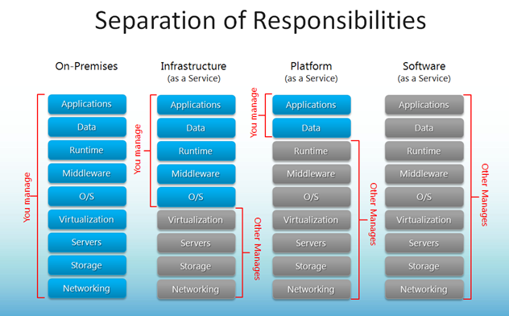

---

title: 雲端 PK - AWS & GCP
categories: 
  - tech
tags:
  - AWS
  - GCP
date: 2017-06-06 19:18:13

---

近年來雲端平台的服務應該大家都不陌生吧～它讓我們可以將維護與建置的工作交付給雲端平台去處理；雲端化以後 IT 維護改由雲端供應商負責，讓我們能花更多的專注力在創新研發上，還能加速部署與模型的建置，使得產品業務更靈活。

那麼，到底該怎麼挑選適合自己公司的雲端？先來基礎複習一下，主要的三種雲端服務類型 IaaS（Infrastructure as a Service，基礎設施即服務）、PasS（Platform as a Service，平台即服務）、SaaS（Software as a Service，軟體即服務），各家平台在服務上也略有不同：

<!-- more -->

## 該選哪朵雲？ ##

### 基礎建設 ###

|                    | AWS                  | GCP                   |
| ------------------ |:--------------------:| :--------------------:|
| 地理區域數量         | 16 regions, 42 zones |  9 regions, 27 zones  |
| 未來擴點            | 3 regions            |  8 regions, 20 zones  |
| Taiwan 有無 regions| X         |  V   |
| Link  | [https://aws.amazon.com/tw/about-aws/global-infrastructure/](https://aws.amazon.com/tw/about-aws/global-infrastructure/ "AWS 簡介") |  [https://cloud.google.com/about/locations/](https://cloud.google.com/about/locations/ "GCP 簡介")   |

### 機器類型 & 運算能力 ###

GCP 可自訂機器類型，但價錢來說差不多

### 計費方式 ###

- GCP 以分計費，提供免費服務 (特定機器)
- AWS 以時計費

> 試算工具
> AWS：[http://calculator.s3.amazonaws.com/index.html](http://calculator.s3.amazonaws.com/index.html)
> GCP：[https://cloud.google.com/products/calculator/](https://cloud.google.com/products/calculator/)

### 服務項目 ###

- AWS 種類玲琅滿目
- GCP 服務較少

## 服務對照 ##

|                    | AWS                  | GCP                   |
| ------------------ |:--------------------:| :--------------------:|
| 雲端虛擬伺服器       | Amazon EC2 |  Google Compute Engine  |
| 無伺服器           | AWS Lambda            |  Google Cloud Functions  |
| 隔離雲端資源 | Amazon Virtual Private Cloud (VPC) | Google Cloud Virtual Network |
| 雲端儲存 | Amazon S3 | Google Cloud Storage | 
| 關聯式資料庫 | Amazon RDS | Google Cloud SQL| 
| NoSQL | Amazon DynamoDB | Google Cloud Bigtable | 
| CDN | AWS Cloudfront | Google Cloud CDN | 
| 監控 | Amazon CloudWatch | Google Cloud Monitoring and Google Cloud Logging | 
| 權限管理 | AWS Identity and Access Management (IAM) | Google Cloud Identity & Access Management (Cloud IAM) | 
| DNS | Amazon Route 53 | Google Cloud DNS | 

## 結語 ##

大多數的人聽到雲端，第一個想到的大多都是 AWS，但目前各家雲端競爭激烈，除了上述介紹的以外還有 MS 的 Azure 等，各家也不斷的在推出新的服務及費率，也或許不會只採用一家的服務，建議還是依照自己的需求選擇自己合適的服務。
