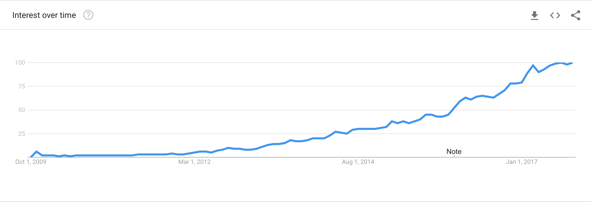
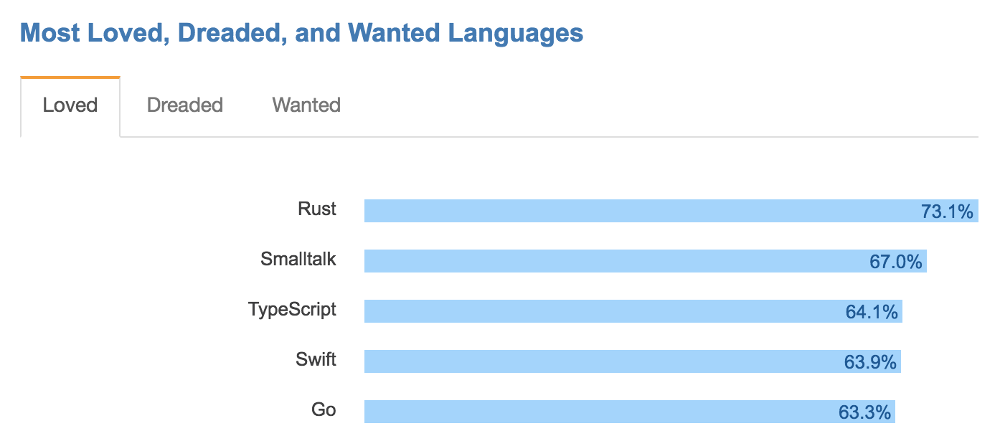
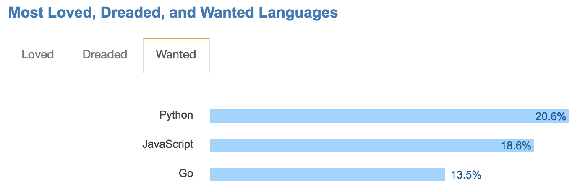

---

title: Go 介紹
categories: 
  - tech
tags:
  - go
  - golang
date: 2018-01-29 10:08:52

---

在一年多以前，開始在社群跟朋友間很常聽到 `Go` 這個程式語言，也很好奇為什麼它突然聲名大噪，為什麼這麼多人推崇，在做了一些功課以後，近期有個機會可以將 `Go` 用在實際的專案上，就來稍微的敘述一下心得好了。

## 背景 & 理念 ##

Google 開發的一種靜態強型別、編譯型、併發型，並具有垃圾回收功能的開源程式語言，於 2009 年面世，也稱作 Golang。由 Rob Pike & Robert Griesemer & Ken Thompson 共同開發，在短短不到十年的時間已在程式排名中有一席之地了，像是獲選 [TIOBE](https://www.tiobe.com/tiobe-index/) 的 2016 最佳語言

<!-- more -->

以下節錄 Rob Pike 在 2012 年的演講中提到的一句話：（[https://www.youtube.com/watch?v=bj9T2c2Xk_s](https://www.youtube.com/watch?v=bj9T2c2Xk_s)）

> Go was designed and developed to make working in this environment more productive. Besides its better-known aspects such as built-in concurrency and garbage collection, Go's design considerations include rigorous dependency management, the adaptability of software architecture as systems grow, and robustness across the boundaries between components.

作者們看到了 Google 在開發上遇到的困境，由於開發環境的變遷：多核處理、網路系統、大規模電腦叢集等等，開發的規模也不同，所以才著手設計這套程式語言。總而言之，Golang 是為了解決實務的軟體工程問題而設計的，而非程式語言上的科研。

網友也畫了漫畫簡介了 Golang：[部落图鉴之Go](https://www.wxnmh.com/thread-1525299.htm)

## 特性 ##

Golang 語言有以下的特性：

- 靜態型別的編譯語言
- 跨平台 (cross-platform)
- 全自動的垃圾回收 (garbage collection)
- 平行處理 (concurrency)
- 程式風格強制統一
- 快速編譯
- 內建開發相關工具
- 豐富的標準函式庫

Golang 是靜態型別的編譯語言，對於程式設計者來說，這類的語言有軟體工程上的優點，像是可以預先進行語法、型別檢查，對於追蹤錯誤更加方便，編譯語言的效能也會比直譯語言好；在編譯時也可針對不同的平台做編譯，達成跨平台的需求；編譯出二進制執行檔後，可直接執行，不需像傳統部署一樣要上傳多個檔案及伺服器的設定；許多的 web 語言都是跑 single thread，所以會閒置許多系統效能，現在的伺服器幾乎都是多核 CPU 了，而 golang 透過 Goroutine 實現了 concurrency，使用者只要設定最大的 thread 數量，和系統是多少 CPU，run-time 就會幫你處理好剩下的 thread 管理。

## 現行服務 & 受歡迎度 ##

Golang 近幾年的成長是大家有目共睹的，像是在 Google 中 Golang 的搜尋也是逐年成長

在 Stack Overflow 2017 的開發者調查中也是名列前茅

目前有很多的開源項目使用 Golang 作為核心語言，如：[Docker](https://github.com/moby/moby)、[rkt](https://github.com/rkt/rkt)、[Kubernetes](https://github.com/kubernetes/kubernetes)、[Flynn](https://github.com/flynn/flynn)、[deis](https://github.com/deis/deis) 等等，更有許多的知名企業也導入了 Golang，如：Google、[Facebook](https://github.com/facebookgo)、Dropbox 等

## 使用考量 ##

在對於 Golang 有初步了解後，就要評估是否適合接下來要導入的專案，畢竟每一個語言都有它適合的場景，牽涉到的可是時間跟金錢，重寫要花費的代價可是非常可觀。

照上面幾點來看，Golang 初始設計的方向就是為了解決大型軟體架構遇到的問題，以軟體工程為設計目的的程式語言，有快速編譯、嚴格的依賴管理、風格統一、Concurrency 控制，但也缺少了一些常見的特性，像是不用繼承，但也有對應的解決方案，又或者說 Golang 因為工程上的考量而精簡了功能。

上面提到近期有一個專案可以讓我試用一下 Golang，是一個關於影像處理的 console application，但因為影像處理的大部分工作是交給另一個工具，所以這裡只是間單的 parser 資料並整理 I/O 的資訊。以撰寫程式碼來說，因我比較熟悉的是 PHP，寫 Golang 時不免覺得囉嗦了點，但 golang 風格統一，相較於 C 也簡單得多，很快就可以略懂略懂了。效能的部分，因為這次的功能較簡單，且 bottleneck 都在影像處理的工具上，所以並沒有顯著的差異，但網路上有許多的實驗數據證明這點，待下次在實驗一下了。再來是 Concurrency Control，這也是 Golang 的特色之一。發佈版本時，Golang 透過編譯可直接產生執行檔執行，不需在機器上再安裝其他東西。另外這次沒有測到 web 的部分是比較可惜的。

## 結語 ##

在看了這麼多以後，來總結一下，Golang 有一個富爸爸，跟現在成長的速度和社群的蓬勃，前途看好，跟大多數通用型程式語言相比，Golang 更多的是為了解決我們在構建大型系統軟體的過程中，所遇到的軟體工程問題而設計的。這麼講可能會讓人感覺 Golang 非常無趣且工業化，但實際上，在設計過程中就著重於清晰和簡潔，以及較高的可組合性，最後得到的反而會是一門使用起來效率高而且很有趣的程式語言，若是還沒嘗試過的話建議玩玩看喔。

