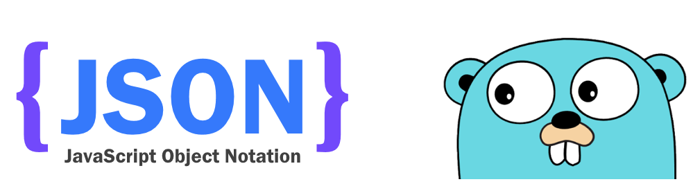

---

title: Golang JSON 處理
categories: 
  - tech
tags:
  - Go
  - golang
  - json
date: 2018-04-30 17:32:35

---

JSON（JavaScript Object Notation）是一種輕量級的資料交換語言，以純文字為基礎去儲存資料，有相容性高、易於理解且許多程式語言都支援等優點。

而在 Golang 之中是如何處理 JSON 的呢？



Golang 官方的 [package](https://golang.org/pkg/encoding/json/) 中已有支援 JSON，可很容易的對 JSON 數據做編解碼

<!-- more -->

## 數據結構 ##

<table>
<tr>
	<th>types</th>
	<th>JSON</th>
	<th>Golang</th>
</tr>
<tr>
	<td>字串</td>
	<td>string</td>
	<td>string</td>
</tr>
<tr>
	<td>整數</td>
	<td>number</td>
	<td>int</td>
</tr>
<tr>
	<td>浮點數</td>
	<td>number</td>
	<td>flaot64</td>
</tr>
<tr>
	<td>陣列</td>
	<td>array</td>
	<td>slice</td>
</tr>
<tr>
	<td>物件</td>
	<td>object</td>
	<td>struct</td>
</tr>
<tr>
	<td>布林</td>
	<td>bool</td>
	<td>bool</td>
</tr>
<tr>
	<td>空值</td>
	<td>null</td>
	<td>nil</td>
</tr>
</table>

## JSON 編碼 ##

JSON 套件裡面透過 [Marshal](https://golang.org/pkg/encoding/json/#Marshal) 函數來將數據處理成 JSON 字串

```golang
func Marshal(v interface{}) ([]byte, error)
```

```golang
package main

import (
    "encoding/json"
    "fmt"
)

type User struct {
    ID int
    Name string
    Money float64
    Skills []string
    Relationship map[string]string
    Identification Identification
}

type Identification struct {
    Phone bool
    Email bool
}

func main() {
    user := User {
        ID:     1,
        Name:   "Tony",
        Skills: []string{"program", "rich", "play"},
        Relationship: map[string]string {
            "Dad": "Hulk",
            "Mon": "Natasha",
        },
        Identification: Identification {
            Phone: true,
            Email: false,
        },
    }
    b, err := json.Marshal(user)
    if err != nil {
        fmt.Println("error:", err)
    }
    fmt.Println(string(b))
}
```

輸出：

```json
{   
    "ID":1,
    "Name":"Tony",
    "Money":0,
    "Skills":
    [
        "program",
        "rich","play"
    ],
    "Relationship":
    {
        "Dad":"Hulk",
        "Mon":"Natasha"
    },
    "Identification":
    {
        "Phone":true,
        "Email":false
    }
}
```

從上面的例子看到 key 值都是大寫，因只有大寫的才會被輸出，但若是需要小寫或其他的名稱怎麼辦呢？ Golang 提供了 `struct tag` 來實現

```golang
...
type Identification struct {
    Phone bool `json:"phone"`
    Email bool `json:"email"`
}
...
```

```json
{
    "ID":1,
    "Name":"Tony",
    "Money":0,
    "Skills":
    [
        "program","rich","play"
    ],
    "Relationship":
    {
        "Dad":"Hulk",
        "Mon":"Natasha"
    },
    "Identification":
    {
        "phone":true,
        "email":false
    }
}
```

### struct tag 還可以有以下功能（取自官方文件） ###

```golang
// Field appears in JSON as key "myName".
Field int `json:"myName"`

// Field appears in JSON as key "myName" and
// the field is omitted from the object if its value is empty,
// as defined above.
Field int `json:"myName,omitempty"`

// Field appears in JSON as key "Field" (the default), but
// the field is skipped if empty.
// Note the leading comma.
Field int `json:",omitempty"`

// Field is ignored by this package.
Field int `json:"-"`

// Field appears in JSON as key "-".
Field int `json:"-,"`
```

又或者需要將輸出全部改為 String，Golang 也有提供此功能

```golang
Int64String int64 `json:",string"`
```


## JSON 解碼 ##

相較 JSON 編碼來說，Golang 對於未知的 JSON 實在是一大挑戰，一開始我們先從已知的結構來看

透過 [Unmarshal](https://golang.org/pkg/encoding/json/#Unmarshal) 將 JSON 字串處理成對應的結構

```golang
func Unmarshal(data []byte, v interface{}) error
```

直接來看例子吧

```golang
package main

import (
    "encoding/json"
    "fmt"
)

type User struct {
    ID int
    Name string
    Money float64
    Skills []string
    Relationship map[string]string
    Identification Identification
}

type Identification struct {
    Phone bool `json:"phone"`
    Email bool `json:"email"`
}

func main() {
    var jsonBlob = []byte(`{"ID":1,"Name":"Tony","Money":0,"Skills":["program","rich","play"],"Relationship":{"Dad":"Hulk","Mon":"Natasha"},"Identification":{"phone":true,"email":false}}`)
    
    var user User
    err := json.Unmarshal(jsonBlob, &user)
    if err != nil {
        fmt.Println("error:", err)
    }
    fmt.Printf("%+v", user)
}
```

解碼與編碼類似，但接受大小寫不同，不過如果欄位是私有的則不會配對

### struct tag ###

如同在編碼的時候，解碼也有對應的 tag，就讓我們來看看吧

- string tag 表示只有字串會被解析，當傳入的值不是字串時會報錯

```golang
...
type User struct {
    ID int
    Name string
    Money float64 `json:",string"`
    Skills []string
    Relationship map[string]string
    Identification Identification
}
...
```

正確：
```
"Money":"100.5"
```

錯誤：
```
"Money":100.5
```

```
error: json: invalid use of ,string struct tag, trying to unmarshal unquoted value into float64
```

- `-` 表示不會被解析，但會給予初始值

## 動態解析 JSON ##

以上介紹的都是理想的狀況，但實際開發時會常常遇到未知的 JSON 格式，或是動態變化的結構，這時候就可以利用以下方法

###  interface & assertion ###

先利用 interface 來儲存任意的數據結構，再利用 assertion 的方式解析數據

```golang
map[string]interface{}
```

範例 a：interface 儲存輸入

```golang
package main

import (
    "encoding/json"
    "fmt"
)

func main() {
    var user map[string]interface{}
    var jsonString string = `{"ID":1, "Name":"Tony"}`
    if err := json.Unmarshal([]byte(jsonString), &user); err != nil {
        fmt.Println("ERROR:",err)
    }
    fmt.Printf("%#v\n", user)
}
```

範例 b：用 assertion 來解析數據

```golang
package main

import (
    "encoding/json"
    "fmt"
)

type User struct {
    ID int
    Name string
    Money float64 `json:",string"`
    Skills []string
    Relationship map[string]string
    Identification Identification
    Career string
    Responsibility interface {}
}

type Identification struct {
    Phone bool `json:"phone"`
    Email bool `json:"email"`
}

func main() {
    var jsonBlob = []byte(`[
        {
            "ID":1,
            "Name":"Tony",
            "Career":"Engineer",
            "Responsibility":{
                "skill":"PHP&Golang&Network",
                "description":"coding"
            }
        },
        {
            "ID":2,
            "Name":"Jim",
            "Career":"Manager",
            "Responsibility":{
                "experienced":true
            }
        }
    ]`)
    
    var users []User
    if err := json.Unmarshal(jsonBlob, &users); err != nil {
        fmt.Println("error:", err)
    }
    fmt.Printf("%#v\n", users)
    fmt.Println(users[0].Responsibility.(map[string]interface{})["description"].(string))
    fmt.Println(users[1].Responsibility.(map[string]interface{})["experienced"].(bool))
}
```

雖然可利用上述方式，但是 code 實在不是很美觀，尤其是在讀出資料的時候

### 利用 *json.RawMessage 延遲解析 ###

上述結構內的 Responsibility 實際上是在解析 Career 才會知道它的資料結構，這時候就可以使用 json.RawMessage 來延遲解析，讓數據以 byte 的方式繼續存在，等待下一次的解析

```golang
package main

import (
    "encoding/json"
    "fmt"
)

type User struct {
    ID int
    Name string
    Money float64 `json:",string"`
    Skills []string
    Relationship map[string]string
    Identification Identification
    Career string
    Responsibility json.RawMessage
}

type Identification struct {
    Phone bool `json:"phone"`
    Email bool `json:"email"`
}

type Engineer struct {
    Skill string `json:"skill"`
    Description string `json:"description"`
}

type Manager struct {
    Experienced bool `json:"experienced"`
}

func main() {
    var jsonBlob = []byte(`[
        {
            "ID":1,
            "Name":"Tony",
            "Career":"Engineer",
            "Responsibility":{
                "skill":"PHP&Golang&Network",
                "description":"coding"
            }
        },
        {
            "ID":2,
            "Name":"Jim",
            "Career":"Manager",
            "Responsibility":{
                "experienced":true
            }
        }
    ]`)
    
    var users []User
    if err := json.Unmarshal(jsonBlob, &users); err != nil {
        fmt.Println("error:", err)
    }

    for _, user := range users {
        switch user.Career {
        case "Engineer":
            var responsibility Engineer
            if err := json.Unmarshal(user.Responsibility, &responsibility); err != nil {
                fmt.Println("error:", err)
            }
            fmt.Println(responsibility.Description)
        case "Manager":
            var responsibility Manager
            if err := json.Unmarshal(user.Responsibility, &responsibility); err != nil {
                fmt.Println("error:", err)
            }
            fmt.Println(responsibility.Experienced)
        default:
            fmt.Println("warning:", "don't exist")
        }
    }
}
```
