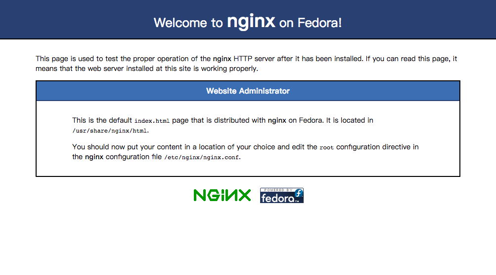
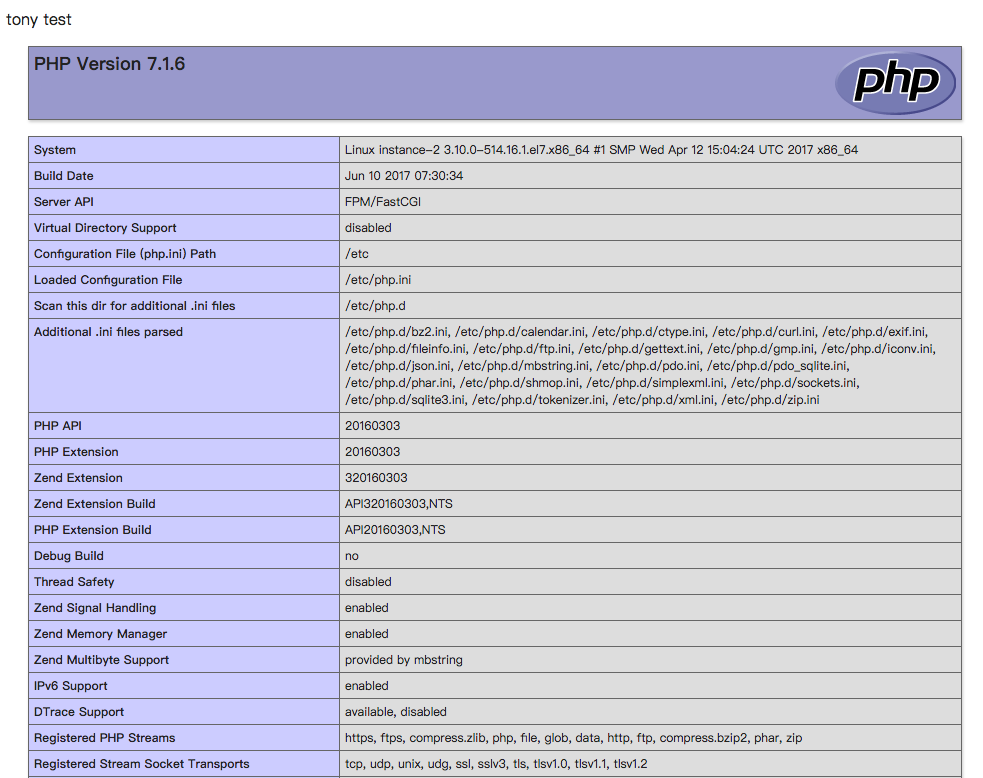

---

title: CentOS 7 上安裝與設定 Nginx + PHP7
categories: 
  - tech
  - GCP
tags:
  - MacOSX
  - git
date: 2017-06-22 19:18:20
updated: 2017-08-22 16:18:20

---

之前在工作上幾乎都是採用 Apache，前一陣子常聽到同事說 Nginx，但我卻沒有實際用過，趁這這次試用 GCP，也來試試看 Nginx

> 注：以下的環境是在 GCE (Google Compute Engine) + CentOS7 上完成。

## 安裝 Nginx ##

要在 yum 中增加 Nginx，需手動加入 repo 設定，這樣就可以透過 yum 安裝了

```bash
# 讓 yum 能找到 nginx
$ vim /etc/yum.repos.d/nginx.repo
```

<!-- more -->

不同的 OS 有不一樣的設定，以下是我的設定 (CentOS7)，其中的 `$releasever` 改成 7

```text
[nginx]
name=nginx repo
baseurl=http://nginx.org/packages/centos/$releasever/$basearch/
gpgcheck=0
enabled=1
```

設定好了以後確認版本 (我的版本是 1.12.1)

```bash
$ yum info nginx
```

安裝 nginx

```bash
$ sudo yum install -y nginx
```

啟用 nginx & 設定開機時啟動

```bash
$ sudo systemctl start nginx
$ sudo systemctl enable nginx
```

再來就可以試試看可不可以連線啦～成功的話就會看到以下畫面



## 安裝 PHP7 ##

因 CentOS 裡的 yum 沒有收錄 PHP，所以自行加入 PHP 7.1 的套件源，這裡就先安裝 webtatic 的 repo，再透過 yum 安裝 PHP

```bash
# epel
$ sudo rpm -Uvh https://dl.fedoraproject.org/pub/epel/epel-release-latest-7.noarch.rpm
# webtatic
$ sudo rpm -Uvh https://mirror.webtatic.com/yum/el7/webtatic-release.rpm
# PHP
$ sudo yum install -y php71w-cli php71w-fpm php71w-common php71w-pdo php71w-mbstring
```

啟用 php & 設定開機時啟動

```bash
$ sudo systemctl start php-fpm 
$ sudo systemctl enable php-fpm
```

確認安裝 & 查詢版本

```bash
$ php -v
```

### 設定 Nginx 和 PHP7 ###

設定 Nginx 可支援 PHP，在需要的服務中加上以下片段，以我的需求是希望全部都支援 PHP，故加在全域的 `server` 區塊中：

```bash
$ sudo vim /etc/nginx/nginx.conf
```

```text
location ~* \.php$ {
    fastcgi_pass 127.0.0.1:9000;
    fastcgi_index index.php;
    fastcgi_split_path_info ^(.+\.php)(.*)$;
    include fastcgi_params;
    fastcgi_param SCRIPT_FILENAME $document_root$fastcgi_script_name;
}
```

再來就是設定 PHP-FPM

```bash
$ vim /etc/php-fpm.d/www.conf
```

```text
user = nginx
group = nginx
```

> Nginx Server 啟動所使用的使用者 CentOS 預設用 `nginx`

都設定完成後就可以重啟啦～

```bash
$ sudo systemctl restart php-fpm
$ sudo systemctl restart nginx
```

Nginx 的預設目錄是 `/usr/share/nginx/html`，在目錄下建一個 index.php 測試是否可以正常運行



## Virtual Host ##

Virtual Host 設定放在 `/etc/nginx/conf.d/*.conf`

## troubleshooting ##

2017-07-21
在建置新的 GCE 時遇到 html & php 都可以正常執行，但是讀取 mp4 檔時會吐出 `13: Permission denied`
後來查到是因為 SELinux，但我是測試用的就先果斷關閉了

```bash
$ vim /etc/sysconfig/selinux 
```

把 `SELINUX=enforcing` 改成 `SELINUX=disabled`，改完以後重開就可以了
