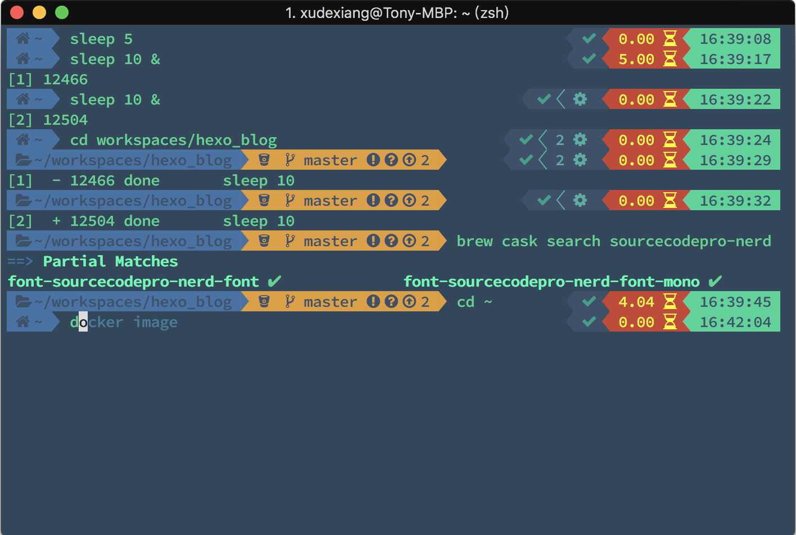
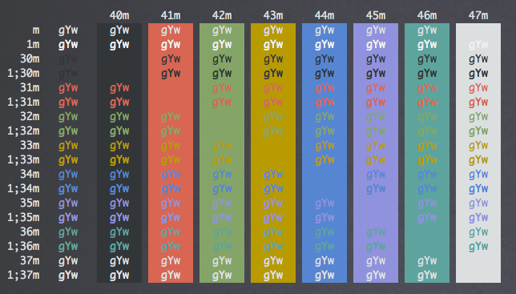
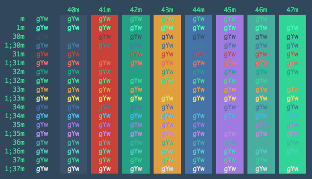

---

title: "打造好用且美觀的 Terminal"
categories: 
  - tech
tags:
  - iTerm2
  - zsh
  - oh-my-zsh
  - powerlevel9k
  - zsh-completions
  - zsh-autosuggestions
  - zsh-syntax-highlighting
date: 2018-05-20 17:35:45

---



身為一個程式設計師，隨身有一個好用的 command line tool，也是很正常的～

我用的是 iterm2 + zsh + oh-my-zsh，這裡就不贅述是為什麼了（因為這組合太多人用了，網路上文章很多拉～），再修改一些設定和加上一些 plugin 來改造 command line 環境。

<!-- more -->

> 接下來會用到 Homebrew 和 brew cask，需先準備好

## 安裝 iTerm2 ##

```zsh
$ brew cask install iterm2
```

## 修改 iTerm2 的 color scheme ##

一開始 iTerm2 預設的樣式實在不是很美觀，還好網友有分享了很多的樣板可以挑選。
可以參考 [iTerm2 Color Schemes](https://github.com/mbadolato/iTerm2-Color-Schemes)，裡面有許多已調好的樣式可以挑選，我自己是挑了以下幾套。

- Solarized Darcula



- ToyChest



再來就是修改設定了，參照以下的步驟：

> Preferences > Profiles > Terminal > Report Terminal Type

將其設為 xterm-256color，等等才能看得到漂亮的顏色，然後到下面的位置去匯入和選用剛剛挑的 color scheme。

> Preferences > Profiles > Colors > Color Presets...

## 安裝字型 ##

接下來的 Theme 會用到特殊的 icon，目前只支援 [Powerline](https://github.com/powerline/fonts) / [Awesome](https://github.com/gabrielelana/awesome-terminal-fonts) / [Nerd](https://github.com/ryanoasis/nerd-fonts) 三種字型，我是選 Nerd 字型，因為它的 icon 最完整，且支援 homebrew 安裝。

```zsh
$ brew tap caskroom/fonts
$ brew cask search nerd
# 找你喜歡的字體
$ brew cask install font-sourcecodepro-nerd-font
```

## 安裝 zsh ##

```zsh
$ brew install zsh

# 把 zsh 加進 shell 清單
# http://linux.vbird.org/linux_basic/0320bash.php#bash_shells
$ sudo sh -c "echo $(which zsh) >> /etc/shells"

# 把 zsh 設定為你的預設 shell
# http://linux.vbird.org/linux_basic/0410accountmanager.php#chsh
$ chsh -s $(which zsh)

# 確認 Shell 是 zsh
$ echo $SHELL
```

## 安裝 oh-my-zsh ##

> 參考：https://github.com/robbyrussell/oh-my-zsh

預設安裝路徑為 `~/.oh-my-zsh`

```zsh
$ sh -c "$(curl -fsSL https://raw.githubusercontent.com/robbyrussell/oh-my-zsh/master/tools/install.sh)"
```

## Theme ##

Oh My Zsh 內建了許多的 Theme，可到它的 [Github](https://github.com/robbyrussell/oh-my-zsh/wiki/Themes) 裡去挑選。

檔案路徑在 `~/.oh-my-zsh/themes` 之中，可以透過修改 `.zshrc` 的 ZSH_THEME 參數來替換，像是要替換成 [agnoster](https://github.com/agnoster/agnoster-zsh-theme)，就會修改成以下的樣子。

```text
ZSH_THEME="agnoster"
```

但這裡我們要用 [powerlevel9k](https://github.com/bhilburn/powerlevel9k)，這個 Theme 並不包含在 default 的 Theme

### 安裝 zsh theme: powerlevel9k ###

```zsh
$ git clone https://github.com/bhilburn/powerlevel9k.git ~/.oh-my-zsh/custom/themes/powerlevel9k
```

### 設定 powerlevel9k ###

透過修改 `~/.zshrc` 以及參照 [官方文件](https://github.com/bhilburn/powerlevel9k#available-prompt-segments) 可以使用不少的功能，但要小心載入過多的功能導致效能變差。

- 這是我採用的設定，可以照個人需求調整

```zshrc
# 採用 nerd 字型（一定要放在套用 Theme 之前）
POWERLEVEL9K_MODE='nerdfont-complete'

# 套用 powerlevel9k Theme
ZSH_THEME="powerlevel9k/powerlevel9k"

DEFAULT_USER="Tony"

# command line 左邊想顯示的內容
POWERLEVEL9K_LEFT_PROMPT_ELEMENTS=(dir dir_writable vcs)

# command line 右邊想顯示的內容
POWERLEVEL9K_RIGHT_PROMPT_ELEMENTS=(status background_jobs command_execution_time time)

# 顯示執行時間
POWERLEVEL9K_COMMAND_EXECUTION_TIME_THRESHOLD=0
```

## Plugin ##

官方推薦套件一覽：  
[https://github.com/robbyrussell/oh-my-zsh/wiki/Plugins-Overview](https://github.com/robbyrussell/oh-my-zsh/wiki/Plugins-Overview)

> 這裡希望 plugin 集中在 ~/.oh-my-zsh/custom/plugins/ 目錄下管理，所以不採用 brew 安裝
 
最後修改 `~/.zshrc` 裡的 `plugins` 加上選用的功能，以下是我的設定值

```zshrc
plugins=(git sublime zsh-completions zsh-autosuggestions zsh-syntax-highlighting)
```

### git ###
內建不需安裝

### sublime ###

[https://github.com/robbyrussell/oh-my-zsh/tree/master/plugins/sublime](https://github.com/robbyrussell/oh-my-zsh/tree/master/plugins/sublime)

內建不需安裝

```zsh
$ st             # 直接打開 sublime
$ st file_name   # 用 sublime 開文件
$ st dir_name    # 用 sublime 開目錄
```

### zsh-completions ###

按 tab 自動完成 command

[https://github.com/zsh-users/zsh-completions](https://github.com/zsh-users/zsh-completions)

```zsh
$ git clone https://github.com/zsh-users/zsh-completions ~/.oh-my-zsh/custom/plugins/zsh-completions
```

### zsh-autosuggestions ###

記憶下過的 commad，並在下一次提示

[https://github.com/zsh-users/zsh-autosuggestions](https://github.com/zsh-users/zsh-autosuggestions)

```zsh
$ git clone https://github.com/zsh-users/zsh-autosuggestions ${ZSH_CUSTOM:-~/.oh-my-zsh/custom}/plugins/zsh-autosuggestions
```

### zsh-syntax-highlighting ###

[https://github.com/zsh-users/zsh-syntax-highlighting](https://github.com/zsh-users/zsh-syntax-highlighting)

```zsh
$ clone https://github.com/zsh-users/zsh-syntax-highlighting.git ${ZSH_CUSTOM:-~/.oh-my-zsh/custom}/plugins/zsh-syntax-highlighting
```

## 結語 ##

『工欲善其事，必先利其器』，每次看同事表演神手寫 code 時，都覺得好帥啊（疑？方向怎麼變成這樣？）  
Command Line 是工程師每天都會用到的工具，有時候也需要長時間觀看，所以才想說趁這次好好的整理一下工具，這樣工作心情也會好得多，一舉數得啊～～


