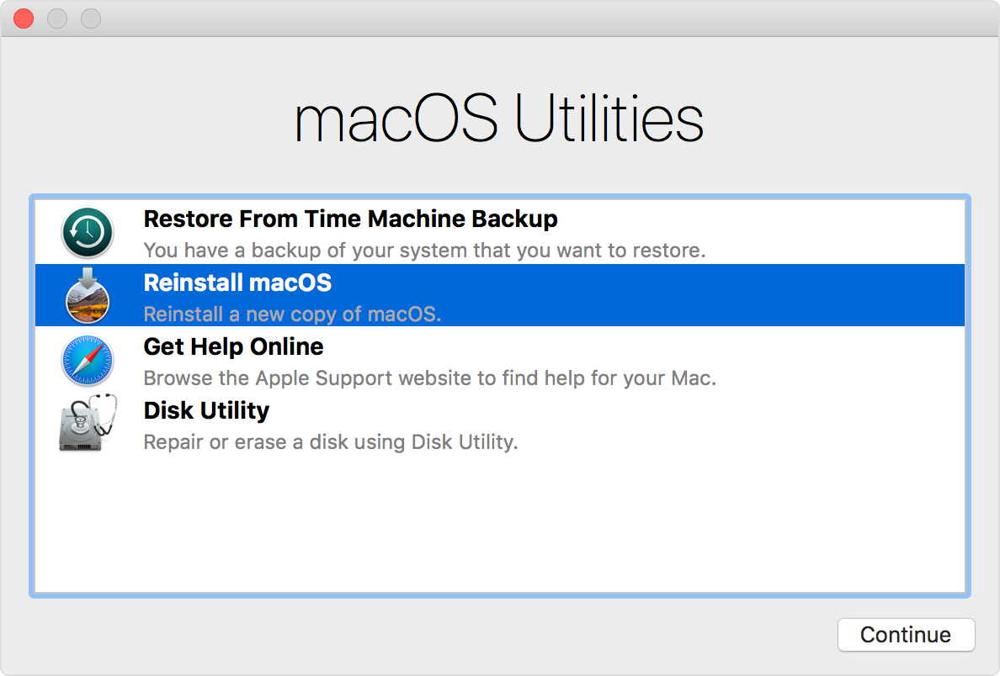

---

title: 重新安裝 macOS
categories: 
  - tech
tags:
  - mac
date: 2017-08-15 15:04:30

---

最近換了新的工作，因舊的 mac 已不敷使用，只好將它脫手買一台最新最潮的 MacBook Pro 了 (不知道是該難過還是高興...)

回到正題，其實 Mac 不太需要重灌，舊的 MacBook Air 也用了好幾年，這中間也都沒有重灌過，不過若是像我一樣是想要賣人，那當然要清乾淨了 ( ~~免得不小心流出什麼~~ )

<!-- more -->

## 用內建磁區開機 ##

在 Mac 出廠時都會有一個隱藏的磁區是可以用來還原系統。
按下電源按鈕啟動 Mac 後，馬上按下組合鍵 `Command（⌘）-R`，等看到 Apple 標誌後放開，就可以看到以下畫面：

## 清除啟動磁碟（如需要）##

1. 在「macOS 回復」的工具程式視窗中，選擇「磁碟工具程式」，然後按一下「繼續」。
2. 在「磁碟工具程式」的側邊欄中，選擇裝置或磁碟。
3. 按一下「清除」按鈕或標籤頁。
4. 填妥下列欄位：
 - 名稱：輸入磁碟的名稱，如「Macintosh HD」。
 - 格式：選擇 Mac OS 擴充格式（日誌式）或 APFS。
 - 架構（如有）：選擇「GUID 分割區配置表」。
5. 按一下「清除」開始清除磁碟。
6. 完成後，結束「磁碟工具程式」，返回工具程式視窗。現在就可以安裝 macOS 了。

## 重新安裝 ##

在工具程式視窗中選擇「重新安裝 macOS」，接下來就下一步下一步就完成了

## 進階 ##

製作開機隨身碟 (待補，允許我富奸一下)

