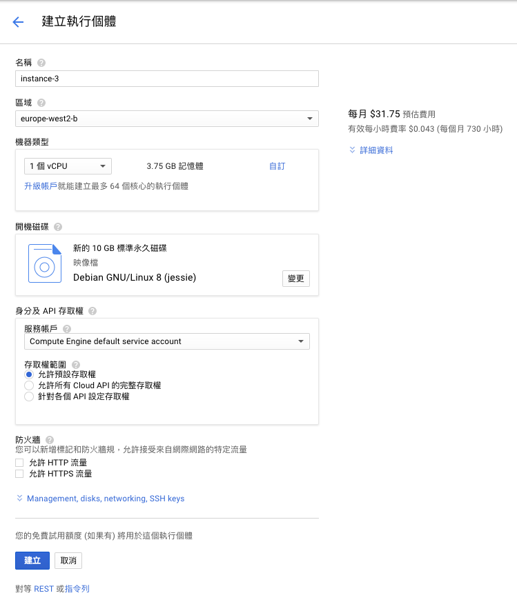

---

title: 開始動手做吧～ 在 GCP 上建立自己的虛擬主機
categories: 
  - tech
tags:
  - GCP
  - GCE
date: 2017-06-19 16:04:30

---

最近申請了 GCP 上的帳號，首年免費試用，且送 300 美金，立馬開一台來玩玩啊。上面也有免費的機器可以使用，在盤算著是否可以把 AWS 上一些小的測試服務搬過來。

## GCP 試用服務 ##

第一年免費獲得 $300 美元的試用額度，當 12 個月後或用完 $300 美元試用額度後結束試用，若是沒有用完，這筆金額將在 12 個月後作廢。Google Cloud Platform 主控台頂端會顯示剩餘的試用額度和天數。

## GCP 永久免費服務 ##

* Google Compute Engine
 - 每個月 1 台 f1-micro VM (限定 US regions，除 Northern Virginia：us-central1、us-west1、us-east1)
 - 每個月 30 GB 硬碟 & 5 GB 快照
 - 每個月 1 GB 的網路出口流量 (除了中國和澳洲)

<!-- more -->

* Google Cloud Datastore
 - 1 GB storage
 - 50,000 reads, 20,000 writes, 20,000 deletes

* Google Cloud Storage
 - 每個月 5 GB of Regional Storage (US regions only)
 - 5000 Class A Operations per month
 - 50000 Class B Operations per month
 - 1 GB network egress from North America to all region destinations per month (excluding China and Australia)

* Google Cloud Functions
 - 2 million invocations per month (includes both background and HTTP invocations)
 - 400,000 GB-seconds, 200,000 GHz-seconds of compute time
 - 5 GB network egress per month

這裡只介紹了部分的服務，若是有興趣的可以參考 GCP 完整的介紹
[https://cloud.google.com/free/docs/always-free-usage-limits/](https://cloud.google.com/free/docs/always-free-usage-limits/ "GCP 永久免費服務")

了解完方案後，就可以開始建立自己的專案啦～

## 建立自己的虛擬主機 ##

### 建立專案 ###

點選上方功能列 → 選擇新增專案填 → 寫專案名稱

### 建立 VM 執行個體 ###

選擇剛建立的專案 → 進入 Compute Engine → VM 執行個體 → 建立

區域：可選擇您所在的區域，像我因為要開免費的機器，所以選擇 `us-west1` 
費率：右方可以估算您目前開的機器大概會花費多少
若是是 WEB server 記得要開防火牆

### 連線 VM ###

建立以後就要要連上去啦～我在這裡是用 SSH 的方式去連線。

方法是：到 Compute Engine → 設定中繼資料 → SSH 金鑰 → 填入你的 SSH public key

