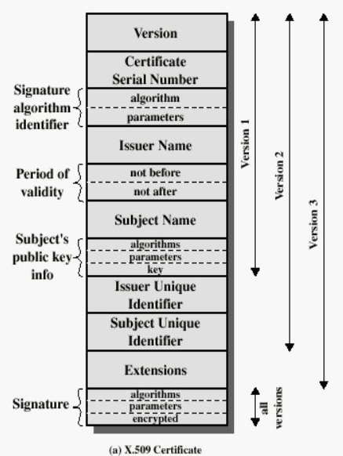
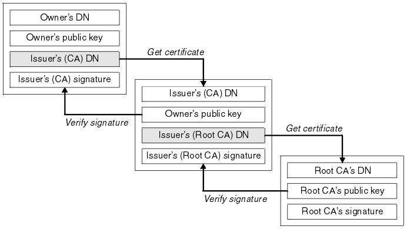
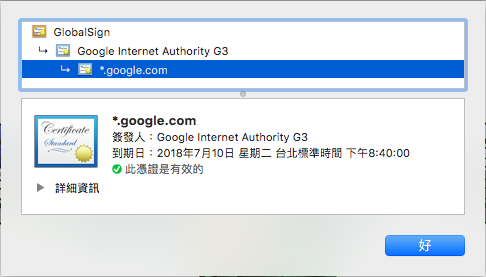
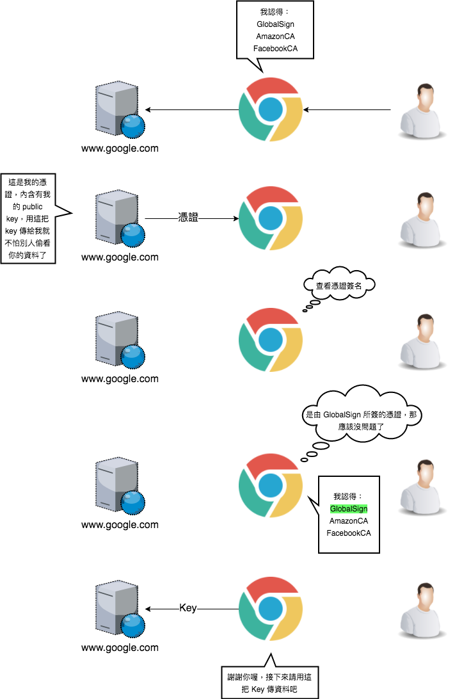
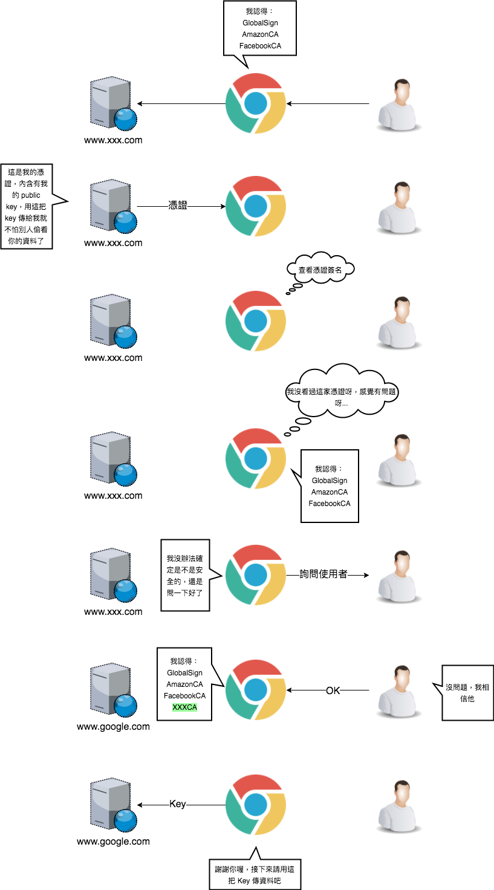

---

title: X.509
categories: 
  - tech
tags:
  - X.509
  - certificate
  - PKI
  - CA
date: 2018-05-15 17:45:35

---

延續上次簡介密碼學的時候有談到 PKI，今天要來看看 X.509 這個廣為使用的數位憑證標準。

先來複習一下名詞吧

> Symmetric Encryption：對稱加密，加解密用同一把鎖  
> Asymmetric Encryption：非對稱加密，用兩把鎖配合來加解密  
> Public Key：非對稱加密中可公開的鎖  
> Private Key：非對稱加密中的私鑰，絕對不可外流  
> Signature：數位簽章，通常是利用內容的 Hash 和 Private Key 所產生的，用來識別發送端身份  
> Man-in-the-middle attack：中間人攻擊指的是駭客利用攔截和偽裝公鑰交換來竄改和轉發訊息  
> PKI：公開金鑰基礎架構提供公鑰和證書的管理  
> CA：Certificate Authority，認證機構也就是憑證簽發的機構  
> Certificate：由 CA 所發的憑證，包含擁有者的資訊、CA、有效日期等訊息  
> CSR（Certificate Signing Request）：憑證簽發請求文件，要透過這份文件去跟 CA 申請憑證  

<!-- more -->

要是對上面沒印象的話就需要去看之前寫的 “” 或者 Google 一下相關資訊

## 什麼是 X.509 ##

X.509 是一種 PKI 的標準，由 ITU-T（國際電信聯盟）在 1988 年制定，基於其以前所制定的 ASN.1 標準。X.509 已用運在許多的面向，包括 TLS/SSL、IOT、電子簽名等等。

### Certificate 結構 ###

在 X.509 憑證採用了 ASN.1 標準，當中包含了公鑰、身份資訊、簽名資訊、有效日期等資訊，大致結構如下：



```
Certificate: 憑證 
- Version: 版本
- Serial Number: 序號
- Signature Algorithm ID: 憑證簽署演算法 ID
- Issuer: 簽發者
- Validity: 有效期
-- Not Before: 此日期前無效
-- Not After: 此日期後無效
- Subject: 擁有者
- Subject Public Key Info: 擁有者公鑰資訊
-- Public Key Algorithm: 公鑰演算法
-- Subject Public Key: 公鑰
- Issuer Unique Identifier (Optional): 簽發者唯一識別
- Subject Unique Identifier (Optional): 擁有者唯一識別
- Extensions (Optional): 擴充
- Certificate Signature Algorithm: 憑證簽署演算法
- Certificate Signature: 憑證簽章值
```

### Certificate 副檔名 ###

X.509 中常用的副檔名如下，其中部分還有其他用途：

- .pem -(Privacy Enhanced Mail)：  
以 Base64 編碼 DER 憑證，並存放在 “-----BEGIN CERTIFICATE-----” 和 “-----END CERTIFICATE-----” 之間。

- .cer, .crt, .der
常使用二進位的 DER 編碼或 Base64 編碼做憑證

- .p7b, .p7c
PKCS#7 憑證結構，不包含資料。

- .p12
PKCS#12 格式包含憑證的公鑰及私鑰 (同時有密碼保護)。

- .pfx
PFX, PKCS#12 的前身

- .bks
Android 用的憑證，由 Bouncy Castle 所實現的 Java Keystore

## 什麼是 Certificate Chain ##

Certificate Chain（憑證鏈）顧名思義是一連串的 Certificate，由 Root CA（根憑證）為起點所延伸出的憑證鏈，在鏈中的每張證書都需要透過前一張驗證



讓我們來看看 Google 的憑證鏈吧：在 Google 使用 HTTPS 時會需要一張 Certificate，而透過瀏覽器我們可以查看到這張 Certificate 所核發的是 `*.google.com`，代表著 google.com 下的所有網站皆適用這張憑證。然後一路追溯到 GlobalSign 這張根憑證，而 GlobalSign 包含在瀏覽器之中，故可以被信任。



## X.509 Sample ##

延續上面的，以 Google 的憑證來做範例，這裡就解碼來看一下憑證的內容，驗證一下剛剛的理論吧。



在瀏覽器之中會認得數家的 CA，透過憑證鏈可得知是由誰所核發的憑證，所以只要是認可的 CA 所核發的就沒有問題了。



但是連上沒有擁有認可過憑證的網站的話就會發出警告並交由用戶決定。

而最後瀏覽器傳送了 key 給 Service，這就要講到 SSL 的交握過程了，非對稱加密雖然安全，但同時犧牲了速度，所以 SSL 採用階段式的做法，在第一階段用非對稱加密，來傳送 “Key”，而這把 Key 就是第二階段對稱加密用來傳送資料的。

然後讓我們來看看憑證內容吧，這裡我節錄了 www.google.com 的憑證

第一張憑證是 `*.googlecomtw.crt`，從 Subject 的 CN 中可以看出他是給哪個 host 用的，裡面也提到了用的是 SHA-256 with RAS 演算法和簽發者是 Google Internet Authority G3 Validity。

```
Certificate:
    Data:
        Version: 3 (0x2)
        Serial Number: 4164209266253688074 (0x39ca3e43c570ed0a)
    Signature Algorithm: sha256WithRSAEncryption
        Issuer: C=US, O=Google Trust Services, CN=Google Internet Authority G3
        Validity
            Not Before: Apr 17 13:42:40 2018 GMT
            Not After : Jul 10 12:39:00 2018 GMT
        Subject: C=US, ST=California, L=Mountain View, O=Google Inc, CN=*.google.com.tw
        Subject Public Key Info:
            Public Key Algorithm: rsaEncryption
                Public-Key: (2048 bit)
                Modulus:
                    00:00:00:00:00:00:00:00:00:00:00:00:00:00:00:
                    00:00:00:00:00:00:00:00:00:00:00:00:00:00:00:
                    00:00:00:00:00:00:00:00:00:00:00:00:00:00:00:
                    00:00:00:00:00:00:00:00:00:00:00:00:00:00:00:
                    00:00:00:00:00:00:00:00:00:00:00:00:00:00:00:
                    00:00:00:00:00:00:00:00:00:00:00:00:00:00:00:
                    00:00:00:00:00:00:00:00:00:00:00:00:00:00:00:
                    00:00:00:00:00:00:00:00:00:00:00:00:00:00:00:
                    00:00:00:00:00:00:00:00:00:00:00:00:00:00:00:
                    00:00:00:00:00:00:00:00:00:00:00:00:00:00:00:
                    00:00:00:00:00:00:00:00:00:00:00:00:00:00:00:
                    00:00:00:00:00:00:00:00:00:00:00:00:00:00:00:
                    00:00:00:00:00:00:00:00:00:00:00:00:00:00:00:
                    00:00:00:00:00:00:00:00:00:00:00:00:00:00:00:
                    00:00:00:00:00:00:00:00:00:00:00:00:00:00:00:
                    00:00:00:00:00:00:00:00:00:00:00:00:00:00:00:
                    00:00:00:00:00:00:00:00:00:00:00:00:00:00:00:
                    00:00
                Exponent: 65537 (0x10001)

...
```

而要驗證 `*.googlecomtw.crt` 這張憑證則需要驗證 `GoogleInternetAuthorityG3.crt` 這張憑證，同樣也需要下一張憑證來驗證。

```
Certificate:
    Data:
        Version: 3 (0x2)
        Serial Number:
            01:e3:a9:30:1c:fc:72:06:38:3f:9a:53:1d
    Signature Algorithm: sha256WithRSAEncryption
        Issuer: OU=GlobalSign Root CA - R2, O=GlobalSign, CN=GlobalSign
        Validity
            Not Before: Jun 15 00:00:42 2017 GMT
            Not After : Dec 15 00:00:42 2021 GMT
        Subject: C=US, O=Google Trust Services, CN=Google Internet Authority G3
        Subject Public Key Info:
            Public Key Algorithm: rsaEncryption
                Public-Key: (2048 bit)
                Modulus:
                    00:00:00:00:00:00:00:00:00:00:00:00:00:00:00:
                    00:00:00:00:00:00:00:00:00:00:00:00:00:00:00:
                    00:00:00:00:00:00:00:00:00:00:00:00:00:00:00:
                    00:00:00:00:00:00:00:00:00:00:00:00:00:00:00:
                    00:00:00:00:00:00:00:00:00:00:00:00:00:00:00:
                    00:00:00:00:00:00:00:00:00:00:00:00:00:00:00:
                    00:00:00:00:00:00:00:00:00:00:00:00:00:00:00:
                    00:00:00:00:00:00:00:00:00:00:00:00:00:00:00:
                    00:00:00:00:00:00:00:00:00:00:00:00:00:00:00:
                    00:00:00:00:00:00:00:00:00:00:00:00:00:00:00:
                    00:00:00:00:00:00:00:00:00:00:00:00:00:00:00:
                    00:00:00:00:00:00:00:00:00:00:00:00:00:00:00:
                    00:00:00:00:00:00:00:00:00:00:00:00:00:00:00:
                    00:00:00:00:00:00:00:00:00:00:00:00:00:00:00:
                    00:00:00:00:00:00:00:00:00:00:00:00:00:00:00:
                    00:00:00:00:00:00:00:00:00:00:00:00:00:00:00:
                    00:00:00:00:00:00:00:00:00:00:00:00:00:00:00:
                    00:00
                Exponent: 65537 (0x10001)
                
...

```


`GlobalSignRootCA-R2.crt` 則是一張根憑證，因為是自己簽署的，所以 Subject 和 會一樣。

```
Certificate:
    Data:
        Version: 3 (0x2)
        Serial Number:
            04:00:00:00:00:01:0f:86:26:e6:0d
    Signature Algorithm: sha1WithRSAEncryption
        Issuer: OU=GlobalSign Root CA - R2, O=GlobalSign, CN=GlobalSign
        Validity
            Not Before: Dec 15 08:00:00 2006 GMT
            Not After : Dec 15 08:00:00 2021 GMT
        Subject: OU=GlobalSign Root CA - R2, O=GlobalSign, CN=GlobalSign
        Subject Public Key Info:
            Public Key Algorithm: rsaEncryption
                Public-Key: (2048 bit)
                Modulus:
                    00:00:00:00:00:00:00:00:00:00:00:00:00:00:00:
                    00:00:00:00:00:00:00:00:00:00:00:00:00:00:00:
                    00:00:00:00:00:00:00:00:00:00:00:00:00:00:00:
                    00:00:00:00:00:00:00:00:00:00:00:00:00:00:00:
                    00:00:00:00:00:00:00:00:00:00:00:00:00:00:00:
                    00:00:00:00:00:00:00:00:00:00:00:00:00:00:00:
                    00:00:00:00:00:00:00:00:00:00:00:00:00:00:00:
                    00:00:00:00:00:00:00:00:00:00:00:00:00:00:00:
                    00:00:00:00:00:00:00:00:00:00:00:00:00:00:00:
                    00:00:00:00:00:00:00:00:00:00:00:00:00:00:00:
                    00:00:00:00:00:00:00:00:00:00:00:00:00:00:00:
                    00:00:00:00:00:00:00:00:00:00:00:00:00:00:00:
                    00:00:00:00:00:00:00:00:00:00:00:00:00:00:00:
                    00:00:00:00:00:00:00:00:00:00:00:00:00:00:00:
                    00:00:00:00:00:00:00:00:00:00:00:00:00:00:00:
                    00:00:00:00:00:00:00:00:00:00:00:00:00:00:00:
                    00:00:00:00:00:00:00:00:00:00:00:00:00:00:00:
                    00:00
                Exponent: 65537 (0x10001)
                
...

```

了解了概念以後就來實做看看吧～

## 實作 X.509 ##

### 產生金鑰 ###

一開始要先有 RSA 公私鑰

#### 產生私鑰 ####
```zsh
$ openssl genrsa -out private.key 2048
# 產生長度為 2048 bits 名為 private.key 的 public key
# 長度越長越安全，但加解密時間越長
```

#### 藉由私鑰產生公鑰 ####
```zsh
$ openssl rsa -in private.key -pubout -out public.key
# -in 輸入私鑰
# -pubout 代表輸出一個公鑰
# -out 公鑰檔名
```

### 產生 CSR ###

要跟 CA 申請憑證的第一步就是要有身份證明文件，但私鑰是不能流出的而且資訊也不太充足，透過 CSR ，裡面會包含許多資訊來給 CA 去做簽署

```zsh
$ openssl req –new –key private.key -out CSR.csr
# -new 表示產生 CSR
# -key 搭配的 key
```

在 CSR 可能含有以下資訊

```
Common Name [CN]：簽署名稱，也就是網域名稱
Organization [O]：組織名稱
Organizational Unit [OU]：組織單位，若沒填寫則跟 Common Name 相同
Country [C]：所在國家
State [ST]：所在的州或省
Locality [L]：所在城市
Key Size：憑證演算法與金鑰長度
```

### 產生證書 ###

#### 自簽 Root 憑證 ####

```zsh
$ openssl x509 -req -days 365 \
-in CSR.csr \
-signkey private.key \
-out RootCA.crt
```

#### 用 Root CA 簽發憑證 ####

做一個新的 private key & CSR，private2.key & CSR2.csr

```zsh
$ openssl x509 -req -days 3650 \
-CA RootCA.crt \
-in CSR2.csr \
-CAkey private2.key \
-out myhost.crt
```

### 查看 PEM 編碼憑證 ###
```zsh
$ openssl x509 -in certificate.pem -text -noout
```
